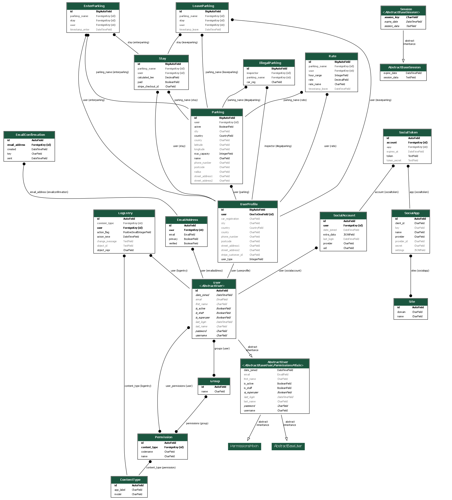

TODO:
add that if the transaction is not paid, button leave should still show.
Problem: Once a transaction was made and paid. Somehow the user got loggedout during payment and the model didnt get updated with `paid = true`. Only seem to happen on local after I havent connected in a while.
Error: when I click on Enter, the console shows a brief error message and then disapear
javascript error on index page due to geolocation
Correct 500 error when normal user clicks on parking manager dashboard : if user doesnt have permission, redirect to home
user cannot enter parking if car registration is not populated + userprofile as a whole
Add back button to all pages
create filtr that only shows activated parkings to user
create a button to tell the parking managert o activate parking
parking can only be activiated with rates have been populated and cannot be 0.
add footer
fix check-out siccess message at Noneafter selecting manually what parking userchecks in
fix logout problem when scanning qr code. Might be SSL certificate realted problem.
Check validators for sign up
check validators for login when email or password is wrong
check all code meets indentions standard and spaces
add validator to make sure parking is null 0 or negative

# M4Project - GeoPay

<!--  -->

View the live site: <a href="https://geopay-12a0f6ced11c.herokuapp.com/" target="_blank">Click Here</a>

# Table of Contents

1. [User Experience](#ux)
   - [Project Goals](#project-goals)
   - [User Stories](#ux-subsection)
2. [Design](#design)
   - [Colours](#colours)
   - [Typography](#typography)
   - [Icons & Images](#icons-images)
   - [Wireframes](#wireframes)
   - [Databases](#databases)
3. [Features](#features)
    - [Authentication](#auth)
    - [Password Reset Via Email](#password-reset)
    - [Media Files : AWS S3 Bucket](#media-files)
    - [Create User Account](#create-user-account)
    - [Read, Edit & Delete User Account](#read-edit-delete-user-account)
    - [User Dashboard](#user-dashboard)
    - [Parking Manager Dashboard](#parking-manager-dashboard)
    - [Create Parking Application](#create-parking)
    - [Read, Edit & Delete Parking](#read-edit-delete-parking)
    - [Create Parking](#create-parking)
    - [Read, Edit & Delete Parking](#read-edit-delete-parking)
    - [Create Parking Rates](#create-parking-rates)
    - [Read, Edit & Delete Parking Rates](#read-edit-delete-parking-rates)
    - [Check-In Parking : Geolocation](#check-in)
    - [Check-Out Parking](#check-out)
    - [Stripe Payment Integration](#stripe)
    - [Crispy Forms](#cripsy)
    - [Decorators](#decorators)
    - [Custom Error Handlers](#error-handler)
4. [Technologies](#tech)
5. [Testing](#testing)
   - [Validator Testing](#val-testing)
     * [HTML](#html)
     * [CSS](#css)
     * [Javascript](#js)
     * [Python](#py)
   - [Lighthouse Testing](#lighthouse-testing)
   - [User Testing](#user-testing)
6. [Bugs](#bugs)
   - [Current bugs](#current-bugs)
   - [Design & User Experience improvements](#design-improvements)
   - [Logic improvements & Backend](#logic-improvements)    
7. [Deployment](#deployment)
   - [Local Deployment](#local-deployment)
   - [Heroku Deployment](#heroku-deployment)
8. [Credits](#credits)

## 1. User Experience 

### 1.1 Project Goals 

As a potential user, I built this project to address a recurring problem I face.

There is a parking where I park once a month, and it rains all the time. If it does rain, there is some strong wind, or it's very cold outside.

Sometimes, all three together.

For me to register my car for parking, I need to walk to the machine, wait for it to connect to some internet, enter my registration and wait even longer for a ticket to be printed, so I can take this ticket to my wind screen.

Some parkings have app. This one does not. But even if it had an app, I probably wouldn't download it.

I want to park and pay, with no inbetween.

This is what this project aims to achieve: a parking payment system based on geolocation, with a webapp.

As a user, I want to check-in by opening the app. Using my phone's GPS, the app will capture my geolocation and check me in automatically.

As I leave, I reopen the app to mark my departure and pay.

No time spent in the outside cold.

### 1.2 User Stories 

**User Management**
* As a user, I want to create an account.
* As a parking user, I want to be able to register my car registration number against my account.
* As a parking user, I want to be able to edit my account details.
* As a parking user, I want to be able to mark myself as a user of the parking by clicking on a button to show what time I arrived.
* As a parking user, I want to automatically mark my entry and exit using geofencing to reduce manual effort.
* As a parking user, I want to select my parking should geolocation fails.
* As a parking user, I want to be able to pay for parking without walking to a machine.
* As a parking user, I want to be automatically charged based on my entry and exit times, with no additional steps.
* As a parking user, I want to be able to check my past transaction.

**Platform Functionality**
* As a platform, I want to record the time the user has registered their arrival and departure at a parking location.
* As a platform, I want to charge the customer based on the time difference between their arrival and departure, multiplied by the hourly fee.
* As a platform, I want to validate the user's location to ensure they are within the parking zone when they mark their arrival or departure.
* As a platform, I want to securely store and process users' sensitive information, like payment details.

**Parking Manager**
* As a parking manager, I want to have a dedicated space to manage my parking from the account I have created.
* As a parking manager, I want to set and adjust the hourly fee for my parking lots.
* As a parking manager, I want to see a live list of all car registrations that have registered their arrival in my parking.
* As a parking manager, I want to be able to physically walk through my parking and inspect if car with registrations that are not marked are parked.
* As a parking manager, I want to keep records of those illegally parked cars, for future penatly process.

## 2. Design 

### 2.1 Colours 
### 2.1 Typography 
### 2.1 Icons & Images 

Icons and images are hosted on S3 Bucket:

* Logo was generated using MidJourney;
* Icons used are mostly coming from FontAwesome;
* Other icons, in particular those used in email find are sourced from Icons8;
* There is no actual images, as it did not add any value to the purpose of the product

### 2.1 Wireframes 
### 2.1 Databases 

    
Click to see ER Diargram

    

        
    

Click to ER Diargram dependency installation process

ERD was generated using django extension `Graphviz`.

To install `Graphviz` these steps were followed:
    * run: `pip install django-extensions`
    * run: `winget install Graphviz`
    * add:

        INSTALLED_APPS = [
        ...
        'django_extensions'
        ]

    * run: `pip install pydotplus`
    * run: `python manage.py graph_models -a -o erd.png`

The databases are split across 3 diffrent apps: 
* `user_management`
* `parking_activity`
* `parking_management`.

Click to see `user_management` app models

| **Model**         | **Field Name**           | **Field Type**       | **Description**                                                   |
|--------------------|--------------------------|-----------------------|-------------------------------------------------------------------|
| **UserProfile**    | `user`                  | OneToOneField         | Links to the Django `User` model.                                |
|                    | `user_type`             | IntegerField          | Type of user (1: User, 2: Parking Manager).                      |
|                    | `phone_number`          | CharField             | Optional phone number.                                           |
|                    | `street_address1`       | CharField             | First line of the user's street address.                         |
|                    | `street_address2`       | CharField             | Second line of the user's street address.                        |
|                    | `city`                  | CharField             | City name.                                                       |
|                    | `county`                | CharField             | County name.                                                     |
|                    | `postcode`              | CharField             | Postal code.                                                     |
|                    | `country`               | CountryField          | Country of residence.                                            |
|                    | `car_registration`      | CharField             | Optional car registration number.                                |
|                    | `stripe_customer_id`    | CharField             | Stripe customer ID for payment processing.   

                    |

Click to see `parking_management` app models

| **Model**     | **Field Name**      | **Field Type**       | **Description**                                                   |
|---------------|---------------------|-----------------------|-------------------------------------------------------------------|
| **Parking**   | `name`              | CharField             | Name of the parking.                                         |
|               | `user`              | ForeignKey            | Links to the `UserProfile` object of the parking manager.               |
|               | `phone_number`      | CharField             | Contact phone number.                                            |
|               | `street_address1`   | CharField             | First line of the parking's address.                            |
|               | `street_address2`   | CharField             | Second line of the parking's address.                           |
|               | `city`              | CharField             | City name.                                                       |
|               | `county`            | CharField             | County name.                                                     |
|               | `postcode`          | CharField             | Postal code.                                                     |
|               | `country`           | CountryField          | Country of the parking location (default: GB).                   |
|               | `max_capacity`      | IntegerField          | Maximum capacity of the parking lot (default: 50).               |
|               | `latitude`          | CharField             | GPS latitude for geolocation.                                    |
|               | `longitude`         | CharField             | GPS longitude for geolocation.                                   |
|               | `radius`            | CharField             | Effective radius for geofencing.                                 |
|               | `active`            | BooleanField          | Check if parking is active.                               |

| **Model**     | **Field Name**      | **Field Type**       | **Description**                                                   |
|---------------|---------------------|-----------------------|-------------------------------------------------------------------| 
**Rate**      | `rate_name`         | CharField             | Name of the rate plan.                                           |
|               | `user`              | ForeignKey            | Links to the `UserProfile` object of the parking manager.               |
|               | `parking_name`      | ForeignKey            | Links to the related `Parking` object.                              |
|               | `hour_range`        | IntegerField          | Duration in hours for which the rate applies.                    |
|               | `rate`              | DecimalField          | Fee for the specified hour range.                                |
|               | `timestamp_leave`   | DateTimeField         | Timestamp when the rate was applied. 

| **Model**     | **Field Name**      | **Field Type**       | **Description**                                                   |
|---------------|---------------------|-----------------------|-------------------------------------------------------------------|
| **IllegalParking** | `inspector`     | ForeignKey            | Links to the inspecting `UserProfile`.                           |
|               | `parking_name`      | ForeignKey            | Links to the `Parking` object illegal car reg. is parked          |
|               | `car_reg`           | CharField             | Car registration of the illegaly parked car.                     | `stripe_customer_id`    | CharField             | Stripe customer ID for payment processing.  |  

Click to see `parking_activity` app models

| **Model**         | **Field Name**           | **Field Type**       | **Description**                                                   |
|--------------------|--------------------------|-----------------------|-------------------------------------------------------------------|
| **Stay**          | `user`                  | ForeignKey            | Links to the `UserProfile` of parking user.                  |
|                   | `parking_name`          | ForeignKey            | Links to the `Parking`.                                      |
|                   | `calculated_fee`        | DecimalField          | Fee calculated based on the stay duration.                       |
|                   | `stripe_checkout_id`    | CharField             | Stripe checkout session ID for the payment.                      |
|                   | `paid`                  | BooleanField          | Check if payment has been made.                               |
| **EnterParking**  | `user`                  | ForeignKey            | Links to the `UserProfile` of the parking user object.                  |
|                   | `parking_name`          | ForeignKey            | Links to the `Parking` object.                                      |
|                   | `stay`                  | ForeignKey            | Links to the associated `Stay` object.                           |
|                   | `timestamp_enter`       | DateTimeField         | Timestamp of entry.                                              |
| **LeaveParking**  | `user`                  | ForeignKey            | Links to the `UserProfile` parking user object.                  |
|                   | `parking_name`          | ForeignKey            | Links to the `Parking`.                                      |
|                   | `stay`                  | ForeignKey            | Links to the associated `Stay` object.                           |
|                   | `timestamp_leave`       | DateTimeField         | Timestamp of departure.                                          | 

## 3. Features 

### 3.1 Authentication 
### 3.1 Password Reset Via Email 
### 3.1 Media Files : AWS S3 Bucket 
### 3.1 Create User Account 
### 3.1 Read, Edit & Delete User Account 
### 3.1 User Dashboard 
### 3.1 Parking Manager Dashboard 
### 3.1 Create Parking Application 
### 3.1 Read, Edit & Delete Parking 
### 3.1 Create Parking 
### 3.1 Read, Edit & Delete Parking 
### 3.1 Create Parking Rates 
### 3.1 Read, Edit & Delete Parking Rates 
### 3.1 Check-In Parking : Geolocation 
### 3.1 Check-Out Parking 
### 3.1 Stripe Payment Integration 
### 3.1 Crispy Forms 
### 3.1 Decorators 
### 3.1 Custom Error Handlers 

## 4. Technologies 

## 5. Testing 
### 5.1 Validator Testing 
#### 5.1.1 HTML 
#### 5.1.2 CSS 
#### 5.1.3 Javascript 
#### 5.1.3 Python 
### 5.2 Lighthouse Testing 
### 5.3 User Testing 

<!-- Click on this link to see manual testing steps: [Manual Testing Guide](MANUAL_TESTING.md) -->

## 6. Bugs 

### 6.1 Current bugs 

### 6.2 Design & User Experience improvements 

### 6.3 Logic improvements & Backend 

## 7. Deployment 

### 7.1 Local Deployment 

To install PostGres on local, the following steps were followed.

To set up of PostGres on Local run : `pip install psycopg2` 

Issues encountered and solution:

This may have been specific to my local setup, but I had to use : pip install psycopg2-binary 

(Documentation: https://pypi.org/project/psycopg2-binary/). My requirements.txt file lists : psycopg2-binary==2.9.9

In settings.py, edit `DATABASES` variables to the following to point to the new local postgres database:

    DATABASES = {
        'default': {
            'ENGINE': 'django.db.backends.postgresql',
            'NAME': 'm4project',
            'USER': '[yourusername]',
            'PASSWORD': '[yourpassword]',
            'HOST': 'localhost',
            'PORT': '5432', 
        }
    }

**Note:** You will need to run your migration again (`python manage.py migrate`) and recreate a new superuser. All data will be lost.

Once this is done, you will want your data stored in a your .env file, to avoid secret keys being publicly available when pushing the project to github and adapting the variables to their environement (local, staging, production...). To do this, do the following:
* enter `pip install python-decouple`
* modify your settings.py to look like this:

    from decouple import config

    DATABASES = {
        'default': {
            'ENGINE': 'django.db.backends.postgresql',
            'NAME': config('DB_NAME'),
            'USER': config('DB_USER'),
            'PASSWORD': config('DB_PASSWORD'),
            'HOST': config('DB_HOST', default='localhost'),
            'PORT': config('DB_PORT', default='5432'),
        }
    }

* Add valuest to variables to .env file. Note these dont need to be in string format, as they are considered strings by default:

    DB_NAME=m4project # your project name
    DB_USER=username # your username
    DB_PASSWORD=password # your password
    DB_HOST=localhost
    DB_PORT=5432

Useful links:
* Instal postgres on local: https://www.postgresql.org/download/
* Extra Documentation: https://pypi.org/project/psycopg2-binary/

### 5.1 Heroku Deployment 

## 8. Credits 

# colour palette

Django setup on local:
* Create `m4project`
* Open to `m4project` folder from terminal
* Create a virtual environment: in terminal enter the following command: `python -m venv env`.
* Activate the virtual environment: `venv/scripts/activate`
* Install Django : `pip install django`.
* Create a new Django project: `django-admin startproject m4project`
* Run the development server: `python manage.py runserver`

GIt ignore setup credits: https://djangowaves.com/tips-tricks/gitignore-for-a-django-project/

## Stripe (credit #payment logic: credits: https://www.youtube.com/watch?v=hZYWtK2k1P8&t=1s)

The tutorial provided by the course material wasnt adapted to what I was looking for. Instead I followed the tutorial from this video (https://www.youtube.com/watch?v=hZYWtK2k1P8&t=1s) and made a number of changes to suit my project.

Improvement: I would like payment to be made without the user having to enter their bank details everytime. I initially wanted to code these in the database, but stripe advises against this. As I wantedt o focus on the geofencing element, I accepted this and left the action for future improvements.

Steps:

* Install Stripe `pip install stripe`
* install Stripe CLI `winget install Stripe.StripeCLI` (for VS Code)
* Get Stripe secret key + public key : create profile on stripe and find them on dashboard + add to .env file
* Get `STRIPE_WEBHOOK_SECRET_TEST`: 
    * Login to stripe form command line: `stripe login`
    * Enter in command line: `stripe listen --forward-to localhost:8000/stripe_webhook`
    * Copy paste key in `STRIPE_WEBHOOK_SECRET_TEST: []` in .env file.

    @login_required 
    def payment(request,applicable_fee, stay_id):
        stripe.api_key = settings
        if request.method == 'POST':
            checkout_session = stripe.checkout.Session.create(
                payment_method_types = ['cards'],
                line_items =[
                    {
                        'price':applicable_fee,
                        'quantity':1,

                    },
                ],
                mode = 'payment',
                customer_creation = 'always',
                succesful_url = settings.REDIRECT_DOMAIN + '/payment_successful?session_id={CHECKOUT_SESSION_ID}',
                cancel_url = settings.REDIRECT_DOMAIN + '/payment_cancelled',
            )
            print(f'checkout_session = {checkout_session}')
            return redirect(checkout_session.url, code=303)

* Add secret keys to .env file

    STRIPE_PUBLIC_KEY_TEST = [the_key_here]
    STRIPE_SECRET_KEY_TEST= [the_key_here]
    STRIPE_WEBHOOK_SECRET = [the_key_here]

* Add to settings .py:
    from dotenv import load_dotenv
    load_dotenv()

    STRIPE_PUBLIC_KEY_TEST = os.getenv('STRIPE_SECRET_KEY')
    STRIPE_WEBHOOK_SECRET = os.getenv('STRIPE_WEBHOOK_SECRET')
    REDIRECT_DOMAIN = os.getenv('REDIRECT_DOMAIN', 'http://localhost:8000')

Errors encountered:
"Error in payment process:No API key provided."
This was fixed by adding initialising the API key at the begining of the logic:
    @login_required
    def payment(request,applicable_fee,stay_id):
        try:
            #set API key the begining to avoid 
            #"Error in payment process:No API key provided."
            stripe.api_key = settings.STRIPE_SECRET_KEY_TEST

Problem make transaction automatic without having to enter card details everytime: 

Error: `Customer instance has invalid ID: None`
Add Stripe cutsomer ID in profile model:

    customer = stripe.Customer.create(
            email=request.user.email
            # Additional customer fields can be added here if needed
        )
        request.user.userprofile.stripe_customer_id = customer.id
        request.user.userprofile.save()

Pass id in logic: 
    customer=request.user.userprofile.stripe_customer_id,

Keep track of payment:
* When user is about to pay, stripe transaction is recorded

    @login_required
    def payment(request,applicable_fee,stay_id):
        ...

            #update stay model field with strip checkout id
            stay = Stay.objects.get(id=stay_id)
            stay.stripe_checkout_id = checkout_session.id
            stay.save()

* When user paid: stripe transaction is marked as true:

    @login_required
    def payment_successful(request):
        stripe.api_key = stripe.api_key = settings.STRIPE_SECRET_KEY_TEST
        checkout_session_id = request.GET.get('session_id', None)
        session = stripe.checkout.Session.retrieve(checkout_session_id)
        customer = stripe.Customer.retrieve(session.customer)
        
        #mark stay payment as successful (bool to Tue)
        stay = Stay.objects.get(stripe_checkout_id=checkout_session_id)
        stay.paid = True
        stay.save()
        print("Payment sucessful!")

## user authentication
Leverage existing template provided by Django All-auth:

In views.py:
    from django.contrib.auth.forms import UserCreationForm
    from django.contrib.auth import login

    def register(request):
        if request.method == "POST":
            form = UserCreationForm(request.POST)
            if form.is_valid():
                user = form.save()
                login(request, user)
                return redirect('home')
        else:
            form = UserCreationForm()
        return render(request, 'account/signup.html', {'form': form})

## static files

* Install packages: `pip install django-storages boto3`
Add to settings.py:

    # Static files (CSS, JavaScript, Images)
    # https://docs.djangoproject.com/en/5.1/howto/static-files/

        STATIC_URL = 'static/'
        STATICFILES_DIRS = [
            os.path.join(BASE_DIR, 'static'),
        ]

        MEDIA_URL = '/media/'
        MEDIA_ROOT = os.path.join(BASE_DIR, 'media')

        STATIC_ROOT = os.path.join(BASE_DIR, 'staticfiles')

* Add to urls.py (project level):
    from django.conf import settings
    from django.conf.urls.static import static

    urlpatterns = [
    ...
    ]

    # Serve media files during development
    if settings.DEBUG:
        urlpatterns += static(settings.MEDIA_URL, document_root=settings.MEDIA_ROOT)

## Setup AWS S3 Bucket
The project does not have any media files, with the exception of the logo and favicon.

As a result, it felt that time should not be invested into a full integration of the S3 bucket.

The steps below cover the initial steps followed to setup an AWS account and host the logo file on S3.
* Create an account
* Create an S3 Bucket (untick `Block all public access`)
* Click on newly created bucket and go to Permissions
* write JSON bucket policy:
* Click `Policy Generator` and entert he following: 
    Type:`S3 Bucket Policy`
    Select `Allow`
    Principal: `*`
    Actions: `GetObject`
    ARN: `[enter ARN number from Properties tab]/*`
* Copy/Paste policy generated into the policy bucket.
* In terminal run:
    `pip install django-storages`
    `pip install boto3`
* In setting.py:

    INSTALLED_APPS = [
    
        #S3 bucket
        'storages',
    ]

## Heroku Setup (Production)
* Log into heorku : `heroku login`
* Add heroku remote : `git remote add heroku [Heroku Git URL]` (can be found in Heroku Settings)
* Push code to Heroku: `git push heroku master`
* Run first migration: `heroku run python manage.py migrate`

Problem encountered: the Procfile generated with command line from documentation echo web: gunicorn app:app > Procfile created an issue relating to encoding. The encoding defaulted to UTF-16 instead of UTF-8.

To solve this problem: create a new Procfile through a Notepad, selected encoding UTF-8 and called it Procfile.txt in the same location as the actual Procfile. I then deleted the previous Procfile and renamed Procfile.txt to Procfile.

### 

setup Debug = False
DEBUG = os.environ.get('DJANGO_DEBUG', '') != 'False'
crdiits: https://developer.mozilla.org/en-US/docs/Learn/Server-side/Django/Deployment

Add whitenoise in settings.py to middleware list

    STATICFILES_STORAGE = 'whitenoise.storage.CompressedManifestStaticFilesStorage'

**Error encountered**: `MIME type ('text/html') is not a supported stylesheet MIME type, and strict MIME checking is enabled.`. whitenoise wasnot installed. Adding whitenoise corrected the error.

**Error encountered**: css file not loading in production. This problem was solved by moving `'whitenoise.middleware.WhiteNoiseMiddleware',` to the top.

    MIDDLEWARE = [
        'django.middleware.security.SecurityMiddleware',
        #whitenoise package : used for production to be set at the top
        'whitenoise.middleware.WhiteNoiseMiddleware',    
    ]

Useful Link:

Credits: https://stackoverflow.com/questions/19846342/unable-to-parse-procfile

## geolocation

Credits: https://www.w3schools.com/html/html5_geolocation.asp

In geolocation.js add:
    const x = document.getElementById("userLocation");

    function getLocation() {
    if (navigator.geolocation) {
        navigator.geolocation.getCurrentPosition(showPosition);
    } else { 
        x.innerHTML = "Geolocation is not supported by this browser.";
    }
    }

    function showPosition(position) {
    x.innerHTML = "Latitude: " + position.coords.latitude + 
    " Longitude: " + position.coords.longitude;
    }

add to base.html:

    
        
    

**Error encountered**: `Uncaught TypeError: Cannot set properties of null (setting 'innerHTML')`. This as a result of the script being uploaded at the begining of the template, before the element exists.

This problem was solved by moving this specific script to the bottom of the body of the template.

* add to index.html:

    <button onclick="getLocation()">Try It</button>
    

Once this has proven to work. We can proceed by incorporating the user location in the logic of `enter()`.

We add a few more variables to `getlocation()`, which will be used to feed some `hidden` input field in the Enter form in enter.html.

* add to geolocation.js:

    document.addEventListener('DOMContentLoaded', function(){
    
    const latitudeField = document.getElementById("userLatitude") # new
    const longitudeField = document.getElementById("userLongitude") # new

    function getLocation() {
        if (navigator.geolocation) {
        navigator.geolocation.getCurrentPosition(showPosition); 
        } else { 
        alert("Geolocation is not supported by this browser.");
        }
    }

    function showPosition(position) {

        const latitude = position.coords.latitude;
        const longitude = position.coords.longitude;

        // adds value to hidden inputs in index.html
        latitudeField.value = latitude; # new
        longitudeField.value = longitude; # new

    }
    getLocation() # new
    })

* add to enter.html the hidden inputs:

    <form method="post">
        
        <input type="hidden" id="userLatitude" name="latitude" value="">
        <input type="hidden" id="userLongitude" name="longitude" value="">
        {{stayform}}
        <input type="submit" onclick="getLocation()" value="OK">
    </form>

* in views.py  in `enter()`:

    @login_required
    def enter(request):
    
        if request.method == "POST":
            # capture user current location
            latitude = request.POST.get('latitude')
            longitude = request.POST.get('longitude')
            print(f'{request.user.username}: latitude = {latitude} + longitude = {longitude}')

Geolocation radius (
* credits: https://stackoverflow.com/questions/42686300/how-to-check-if-coordinate-inside-certain-area-python
* https://geopy.readthedocs.io/en/stable/#module-geopy.distance)

* Install Geopy: `pip install geopy`
* import geopy in views.py (parking_activity app):

    from parking_management.models import Parking

* add distance calculation logic between user and parkings `enter()`:

    @login_required
    def enter(request):
    
        if request.method == "POST":
            ...

            # set user location in tuple
            user_location = [{'lat': {user_latitude}, 'lng': {user_longitude}}]
            user_location_tuple = (float(user_latitude), float(user_longitude))
          
            # match current user location to parking radius (if any)
            parkings = Parking.objects.all()
            
            # create for loop of parkings
            for parking in parkings:

                parking_radius = float(parking.radius)
                
                # set parking location in tuple
                parking_location_tuple = (float(parking.latitude), float(parking.longitude))

                #measure distance between user location and parking location
                locations_distance = distance.distance(
                    user_location_tuple,
                    parking_location_tuple).meters
                
                print("Distance: {}".format(locations_distance))

                if locations_distance <= parking_radius:
                    print(f'You are in {parking.name}')

                    ...

                else:
                    print(f'You are not in {parking.name}')

**Error encountered** `TypeError: float() argument must be a string or a real number, not 'set'`: following Igor-S answer on stackoverflow, I encountered this error.

This is because of the use of `({})`, which in Python define a set, rather than parentheses `()`.

To fix this error by converting the values into `float`:
    
    user_location = (float(user_latitude), float(user_longitude))

**Error encountered** `TypeError: '<=' not supported between instances of 'float' and 'str'`: following the above mentioned example provided on stackoverflow.

This error happened because `parking.radius` is a string and `locations_distance` is a float.

    if locations_distance <= parking_radius:
        print(f'You are in {parking.name}')
    else:
        print(f'You are not in {parking.name}')

Both values need to be in the same format:

    parking_radius = float(parking.radius)

**Error encountered** User geolocation innacuracy: in order to deal with lack of accuracy of the user location (which seems to be between 3m to 888m range based on various test), the minimum parking radius has been set to 1km (1000m).

In future development, this radius could be drastically reduced by using GPS location. This would require using native features of the phone. Either through a mobile app, or using Django's progressive web app.

* handle redirect to identified parking_id or not

Due to potential innacuracy in geolocation, `get_parking_location()` might not return a parking ID.

Depending on the scenario, `get_parking_location()` will redirect the user with out without the `parking id` as a parameter:

    return redirect('enter_with_parking_id', parking_id=parking_name.id)

    or

    return redirect('enter') 

To handle these two scenarios, two paths leading to the same view were made available:

    path('enter/', views.enter, name='enter'),
    path('enter/<int:parking_id>/', views.enter, name='enter_with_parking_id'),

The parameter is then returned in `enter()` and is given a default value of `None`:

    def enter(request, parking_id=None):

* StayForm() handling and submission

This part is handled by `enter()` and considers two scenarios through a form:
* if parking_id is provided as an argument, the user is asked to confirm they are happy to be marked as having entered `parking_id`
* if parking_id is None, the user is asked to select the parking name from a drop down menu.

Upon submission of the form, a Stay object is created, together with an Enter Object, both are linked via a foreign Key.

* rendering of parking fees (javascript)

Within the javascript document, the following logic is applied:

First implement a logic that collects the `parking_id`:

If provided as a parameter, the logic picks up the parking_id from the url

    // sets parking id as null by default
    let parkingId = "null";
    // captures parameter from url (if any)
    const path = window.location.pathname;
    const match = path.match(/\/enter\/(\d+)\//);
    const parkingIdFromParam = match ? match[1] : null;
    console.log(`parking id is ${parkingIdFromParam}`);

If not provided as parameter, a drop down menu needs to be added to the html template looping over the different parking names available.

    <!-- If parking ID is None -->
    <form method="post">
        
        <label for="parking-select">Select Parking:</label>
        <select id="parking-select" name="parking_name">
            <option value="">Select parking</option>
            
                <option value="{{ parking.id }}" 
                    
                        selected
                    >
                    {{ parking.name }}
                </option>
            
        </select>
        <input type="submit" value="Submit the form">
    </form>

Once a parking name is selected, variable `manuallySelectedParking` collects the chosen parking name, which in turn give `parkingId` the id of the parking selected.

    const manuallySelectedParking = document.getElementById('parking-select');
        console.log("manuallySelectedParking=", manuallySelectedParking);

    if(manuallySelectedParking){
        manuallySelectedParking.addEventListener('change', function(){
            console.log("this is getting accessed")
            parkingId = this.value || "null";
            console.log(`Updated parking id is ${parkingId}`);
            // only trigger fetchRates() if parking_id is not null
            // to avoid 404 error in console
            if (parkingId !== "null"){
                fetchRates();
            }
                
            })

Once `parking_id` is retrieved, the logic calls `get_parking_rates()` to return the parking rates. The function dynamically returns parking fees based on the parking selected.

    #used to get parking rates through API (dynamically generated with js)
    #note: safe = False allows to return a list instead of a dictonnary
    # this is because Json expect a dict by default (add error to log of errors encourntered)
    # credits: https://dev.to/chryzcode/django-json-response-safe-false-4f9i
    def get_parking_rates(request, parking_id):
        print(f'get_parking_rates parking id = {get_parking_rates}')
        rates = Rate.objects.filter(parking_name_id = parking_id).values(
            'rate_name',
            'hour_range',
            'rate',
        )
        return JsonResponse(list(rates), safe=False)

`get_parking_rates()` is called from parking_fee.js at the bottom of template : `enter.html`
    
**enter.html**

    
    
    

**parking_fee.js**

Create function `fetchRates()` to dynamically collect applicables rates from selected parking form the database.

    function fetchRates(){
        console.log(`ParkindId in fetchRates= ${parkingId}`);
        if(parkingId){
            fetch(`/parking_activity/get_parking_rates/${parkingId}/`)
            .then(response => response.json())
            .then(data =>{
                console.log("Fetched rates", data);
                renderRatesTable(data);
            })
            .catch(error => console.error("theres an error when getting the rates", error))
        }   
    }

Once the data is collected, it can then be rendered in `enter.html` template with `renderRatesTable()`.

    function renderRatesTable(data){

        // get the body of the table
        const table = document.getElementById("ratesTable");
        const tbody = document.querySelector("table tbody")
        tbody.innerHTML = "";

        if(data.length>0){
            
            // shows table
            table.style.display ="table"
            // Adds data to table rwos

            data.forEach(rate=>{
                const tableRow = document.createElement('tr');
                tableRow.innerHTML = `
                <tr>
                    <td>${rate.rate_name}</td>
                    <td>${rate.hour_range}</td>
                    <td>${rate.rate}</td>
                </tr>
                `;
                tbody.appendChild(tableRow);
            });
        }else{
            table.style.display = "none"
        }
    }

    <table>
        <thead>
            <tr>
                <th>Rate Name</th>
                <th>Hour Range</th>
                <th>Rate</th>
            </tr>
        </thead>
        <tbody></tbody>
    </table>

Problem encountered: error generated in the console `404 Page Not Found` when parkingId is null. To cover this, `fetchRates()` in wrapped within an if statement that checks if parkingId is null before triggering `fetchRates()`

    if (parkingId !== "null"){
        fetchRates()
    }

Useful links:
* https://developer.mozilla.org/en-US/docs/Web/API/Geolocation_API
* https://stackoverflow.com/questions/42686300/how-to-check-if-coordinate-inside-certain-area-python
* https://geopy.readthedocs.io/en/stable/#module-geopy.distance

# Parking Management App

## Parking Manager Dashboard

## Create New Parking (form)

This feature is managed by `create_parking()`. 

To enable this `ParkingForm` is created in forms.py, allowing to create Parking model objects.

Upon successful submission, the newly created object passes its id, as a parameter to redirect the user to `parking_info()`

Use Crispy Forms:
* Run `pip install django-crispy-forms`
* Run `pip install crispy-bootstrap5`
* Run `pip install django-countries`

* In Installed_apps (Settings.py) add:

    INSTALLED_APPS = [
        'django.contrib.admin',
        ...
        #crispy form packages
        'crispy_forms',
        'crispy_bootstrap5',

    ]
* In Settings.py, add:

    CRISPY_TEMPLATE_PACK = 'bootstrap5'

## See Parking Details (CRUD)

# Parking Rates (CRUD)

# Parking Inspector (see registration, take note of those not registered)

## JS Validators on signup

## django logging to see logs in production

import os

    LOGGING = {
        "version": 1,
        "disable_existing_loggers": False,
        "handlers": {
            "console": {
                "class": "logging.StreamHandler",
            },
        },
        "root": {
            "handlers": ["console"],
            "level": "WARNING",
        },
        "loggers": {
            "django": {
                "handlers": ["console"],
                "level": os.getenv("DJANGO_LOG_LEVEL", "INFO"),
                "propagate": False,
            },
        },
    }

ciredits: https://docs.djangoproject.com/en/5.1/topics/logging/

## is_parking_customer()

## is_parking_manager()
Used to prevent non `parking_manager` user types to access parking_management app functions.

    class UserProfile(models.Model):
        user = models.OneToOneField(User, on_delete=models.CASCADE)
        user_type = models.IntegerField(choices=USER_TYPE, default = 1)
    

    def is_parking_manager(request):
        print(f'request.user.userprofile.user_type: {request.user.userprofile.user_type}')
        if request.user.userprofile.user_type != 2:
            return False
        return True

        @login_required
    def parking_manager_dashboard(request):
        if not is_parking_manager(request):
            return redirect('home')
        
        ...

If the user_type is not '2' (parking manager), return user to home page.

## decorators
from django.views.decorators.http import require_POST
@login_required

from django.contrib.auth.decorators import login_required
login_required

## error handlers
urls.py (project level):

    from django.conf.urls import handler404, handler500, handler403, handler400

    urlpatterns = [....
    ] 

    handler404 = 'user_management.views.handler404'
    handler500 = 'user_management.views.handler500'
    handler403 = 'user_management.views.handler403'
    handler400 = 'user_management.views.handler400'

In views.py (app level):

    def handler404(request, exception):
        """ Handle 404 errors and render the custom 404 error page """
        return render(request, 'errors/404.html', status=404)

    def handler500(request):
        """ Handle 500 errors and render the custom 500 error page """
        return render(request, 'errors/500.html', status=500)

    def handler403(request, exception):
        """ Handle 403 errors and render the custom 403 error page """
        return render(request, 'errors/403.html', status=403)

    def handler400(request, exception):
        """ Handle 400 errors and render the custom 400 error page """
        return render(request, 'errors/400.html', status=400)

    def test_500_error(request: HttpRequest):
        """ Raise a test exception for the 500 error handler """
        raise Exception("Test 500 error")

    def test_403_error(request):
        """ Raise a test exception for the 403 error handler """
        raise PermissionDenied("Test 403 error")

    def test_400_error(request):
        """ Raise a test exception for the 400 error handler """
        raise SuspiciousOperation("Test 400 error")

Add templates in: `app_name/templates/errors/template_name`

## Problem encountered - user getting logged out on mobile phone 
when opening new borwser window when scanning QR code

To solve this problem, add to settings.py:

    # Prevent sessions from being reset
    CSRF_COOKIE_SECURE = True
    SESSION_COOKIE_SECURE = True 
    SESSION_ENGINE = 'django.contrib.sessions.backends.cached_db'
    SESSION_COOKIE_DOMAIN = '.geopay-12a0f6ced11c.herokuapp.com'
    CSRF_TRUSTED_ORIGINS=['https://*.geopay-12a0f6ced11c.herokuapp.com']

credits: https://stackoverflow.com/questions/3976498/why-doesnt-session-expire-at-browser-close-true-log-the-user-out-when-the-bro

This has improve the result. However, the problem still persist. This could be due to the fact I havent deployed the SSL certificate on the site, as this is a paying feature.

## custom email
Created : `password_reset_key_message.html` in path: `templates\allauth\account\email\password_reset_key_message.html`

Django will by default look for an html file before retouring the the txt file.

The email template was generated from a template taken from : https://tabular.email/

Credits:
Validation for login : https://stackoverflow.com/questions/74245576/the-problem-of-not-displaying-validation-messages-in-allauth-after-overriding-al

## sites used
https://cdnjs.com/ : for cdn links
https://tabular.email/: for email template
https://icons8.com/ : icons on email
