TODO:


remove unused code
remove all print statements
check all code meets indentions standard and spaces


BUGS
Bug - back button doesnt work after using lighthouse testing.
Problem: Once a transaction was made and paid. Somehow the user got loggedout during payment and the model didnt get updated with `paid = true`. Only seem to happen on local after I havent connected in a while.
bugs - the logo image on email does not show on certain messaging system like outlook desktop, but will show on outloop mobile app.
bugs - the javascript validator are capital sensitive and will show a warning taht two email addresses dont match if one email has a capital and the other doesnt, but the authentictaion system will accept it.
Add Favicon


List all money made within specific period
Add filters in transaction for user to retrieve specific transaction easily
Add visual of parking on map to clarify if latlng coordinates have been entered properly by parking manager
Rework te way parkign rates are made and create a standard presentation : [value] hour for [value] instead of letting parking manager give it a title
Some repeats in codes in particular with validators preventing parking user and parking manager taking some actions on checked-in parkings.
Could add a validator if all parking spaces are checked-in to prevent user to do so. Equally why would the parking company refuse to make money?
Imrpoevement deisgn - parking info could be improve. too much space is taken for the first 3 sections. All could fit in 1 line with header in a row above.
Imrpoevement deisgn - parking info could be improve. Applicable rates could also be brought over 1 line and collapse into 2 rows based on screen size
ask Gareth about label of hidden fields in html checker
imrpoevemt: parking insepctor can be imporved with OCR and connecting to a CRM to issue PCR
success messages get stacked up until user authenticates
Add command to collectstatic autmatically at every push
fix logout problem when scanning qr code. Might be SSL certificate realted problem.
Back button without <p> not showing a hand cursor.

#note: there is redundancy in some of the FK, but equally adds more visibility from admin panel
class EnterParking(models.Model):
    user = models.ForeignKey(UserProfile, on_delete=models.SET_NULL, null=True, blank=True)
    parking_name = models.ForeignKey(Parking, on_delete=models.SET_NULL, null=True, blank=True)
    stay = models.ForeignKey(Stay, on_delete=models.SET_NULL, null=True, blank=True)
    timestamp_enter = models.DateTimeField(auto_now_add=True, null=True, blank=True)

    def __str__(self):
        return f"{self.id}"

Sometimes success messages dont show.


        

# M4Project - GeoPay

<p align="center" width="100%">
   
</p>

View the live site: <a href="https://geopay-12a0f6ced11c.herokuapp.com/" target="_blank">Click Here</a>

## Getting Started

The project was built with the aim of being used from small to large screens and is fully responsive.

However one of the core feature requires accurate geolocation, on the customer side.

Once you have setup a parking under the desired geolocation, as parking manager, please scan the QR code to access the deployed project from your mobile phone.

<p align="center" width="100%">
   
</p>


# Table of Contents

1. [User Experience](#ux)
   - [Project Goals](#project-goals)
   - [User Stories](#ux-subsection)
2. [Design](#design)
   - [Colours](#colours)
   - [Typography](#typography)
   - [Icons & Images](#icons-images)
   - [Wireframes](#wireframes)
   - [Databases](#databases)
3. [Features](#features)
    - [Authentication](#auth)
    - [Password Reset Via Email](#password-reset)
    - [Media Files : AWS S3 Bucket](#media-files)
    - [User Profile](#user-profile)
    - [User Dashboard](#user-dashboard)
    - [Parking Manager Dashboard](#parking-manager-dashboard)
    - [Create Parking](#create-parking)
    - [Read, Edit & Delete Parking](#read-edit-delete-parking)
    - [Create Parking Rates](#create-parking-rates)
    - [Read, Edit & Delete Parking Rates](#read-edit-delete-parking-rates)
    - [Check-In Parking : Geolocation](#check-in)
    - [Check-Out Parking](#check-out)
    - [Stripe Payment Integration](#stripe)
    - [Crispy Forms](#cripsy)
    - [Decorators](#decorators)
    - [Custom Error Handlers](#error-handler)
    - [Parking Inspector](#parking-inspector)
    - [Back Button](#back-button)
4. [Technologies](#tech)
5. [Testing](#testing)
   - [Validator Testing](#val-testing)
     * [HTML](#html)
     * [CSS](#css)
     * [Javascript](#js)
     * [Python](#py)
   - [Lighthouse Testing](#lighthouse-testing)
   - [User Testing](#user-testing)
6. [Bugs](#bugs)
   - [Current bugs](#current-bugs)
   - [Design & User Experience improvements](#design-improvements)
   - [Logic improvements & Backend](#logic-improvements)    
7. [Deployment](#deployment)
   - [Local Deployment](#local-deployment)
   - [Heroku Deployment](#heroku-deployment)
8. [Credits](#credits)


## 1. User Experience <a name="ux"></a>

### 1.1 Project Goals <a name="project-goals"></a>

As a potential user, I built this project to address a recurring problem I face.

There is a parking where I park once a month, and it rains all the time. If it does rain, there is some strong wind, or it's very cold outside.

Sometimes, all three together.

For me to register my car for parking, I need to walk to the machine, wait for it to connect to some internet, enter my registration and wait even longer for a ticket to be printed, so I can take this ticket to my wind screen.

Some parkings have app. This one does not. But even if it had an app, I probably wouldn't download it.

I want to park and pay, with no inbetween.

This is what this project aims to achieve: a parking payment system based on geolocation, with a webapp.

As a user, I want to check-in by opening the app. Using my phone's GPS, the app will capture my geolocation and check me in automatically.

As I leave, I reopen the app to mark my departure and pay.

No time spent in the outside cold.

### 1.2 User Stories <a name="user-stories"></a>

**User Management**
* As a user, I want to create an account.
* As a parking user, I want to be able to register my car registration number against my account.
* As a parking user, I want to be able to edit and delete my account details.
* As a parking user, I want to be able to mark myself as a user of the parking by clicking on a button to show what time I arrived.
* As a parking user, I want to automatically mark my entry and exit using geofencing to reduce manual effort.
* As a parking user, I want to select my parking should geolocation fails.
* As a parking user, I want to be able to pay for parking without walking to a machine.
* As a parking user, I want to be automatically charged based on my entry and exit times, with no additional steps.
* As a parking user, I want to be able to check my past transaction.

**Platform Functionality**
* As a platform, I want to record the time the user has registered their arrival and departure at a parking location.
* As a platform, I want to charge the customer based on the time difference between their arrival and departure, multiplied by the hourly fee.
* As a platform, I want to validate the user's location to ensure they are within the parking zone when they mark their arrival or departure.
* As a platform, I want to securely store and process users' sensitive information, like payment details.
* As a platform I want to enable payment through a third party platform like Stripe

**Parking Manager**
* As a parking manager, I want to have a dedicated space to manage my parking from the account I have created.
* As a parking manager, I want to set and adjust the hourly fee for my parking lots.
* As a parking manager, I want to see a live list of all car registrations that have registered their arrival in my parking.
* As a parking manager, I want to be able to physically walk through my parking and inspect if car with registrations that are not marked are parked.
* As a parking manager, I want to keep records of those illegally parked cars, for future penatly process.

## 2. Design <a name="design"></a>

### 2.1 Colours <a name="colours"></a>

The main colours used for this project are the following:


### 2.2 Typography <a name="typography"></a>

The project uses Albert Sans, to create a modern and accessible font.

The font is sourced from Google.

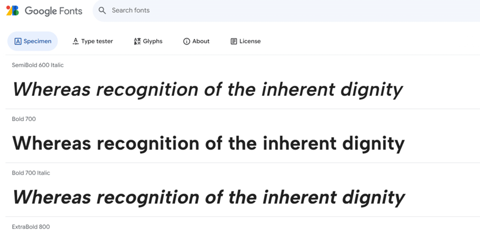

### 2.3 Icons & Images <a name="icons-images"></a>

Icons and images are hosted on S3 Bucket:

* Logo was generated using MidJourney;
* Icons used are mostly coming from FontAwesome;
* Other icons, in particular those used in email find are sourced from Icons8;
* There is no actual images, as it did not add any value to the purpose of the product

### 2.4 Wireframes <a name="wireframes"></a>

Wireframes initially designer for the project are available below.

<details>
    <summary style="color: white; background: black; padding: 5px;">Click to see wireframes</summary>
    <p align="center">>
        <kbd>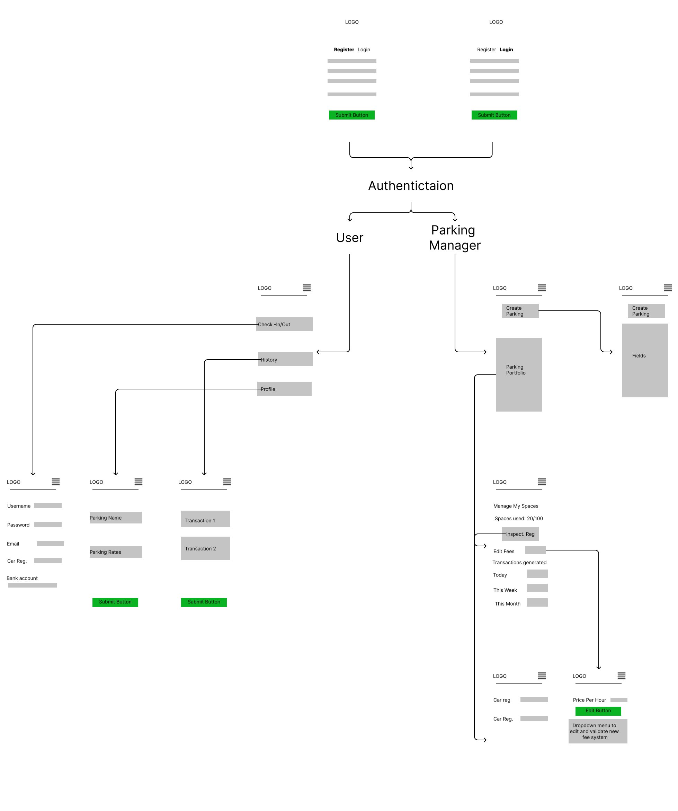</kbd>
    </p>
</details>

### 2.5 Databases <a name="databases"></a>

<details>
    <summary style="color: white; background: black; padding: 5px;">Click to see ER Diargram</summary>
    <p>
        <kbd></kbd>
    </p>
</details>

<details>
<summary style="color: white; background: black; padding: 5px;">Click to ER Diargram dependency installation process</summary>
<p>

ERD was generated using django extension `Graphviz`.

To install `Graphviz` these steps were followed:
* run: `pip install django-extensions`
* run: `winget install Graphviz`
* add:

        INSTALLED_APPS = [
        ...
        'django_extensions'
        ]

* run: `pip install pydotplus`
* run: `python manage.py graph_models -a -o erd.png`

</p>
</details>

The databases are split across 3 diffrent apps: 
* `user_management`
* `parking_activity`
* `parking_management`.

<details>
<summary style="color: white; background: black; padding: 5px;">Click to see `user_management` app models</summary>
<p>

| **Model**         | **Field Name**           | **Field Type**       | **Description**                                                   |
|--------------------|--------------------------|-----------------------|-------------------------------------------------------------------|
| **UserProfile**    | `user`                  | OneToOneField         | Links to the Django `User` model.                                |
|                    | `user_type`             | IntegerField          | Type of user (1: User, 2: Parking Manager).                      |
|                    | `phone_number`          | CharField             | Optional phone number.                                           |
|                    | `street_address1`       | CharField             | First line of the user's street address.                         |
|                    | `street_address2`       | CharField             | Second line of the user's street address.                        |
|                    | `city`                  | CharField             | City name.                                                       |
|                    | `county`                | CharField             | County name.                                                     |
|                    | `postcode`              | CharField             | Postal code.                                                     |
|                    | `country`               | CountryField          | Country of residence.                                            |
|                    | `car_registration`      | CharField             | Optional car registration number.                                |
|                    | `stripe_customer_id`    | CharField             | Stripe customer ID for payment processing.                       |

</p>
</details>

<details>
<summary style="color: white; background: black; padding: 5px;">Click to see `parking_management` app models</summary>
<p>

| **Model**     | **Field Name**      | **Field Type**       | **Description**                                                   |
|---------------|---------------------|-----------------------|-------------------------------------------------------------------|
| **Parking**   | `name`              | CharField             | Name of the parking lot.                                         |
|               | `user`              | ForeignKey            | Links to the `UserProfile` of the parking manager.               |
|               | `phone_number`      | CharField             | Contact phone number.                                            |
|               | `street_address1`   | CharField             | First line of the parking's address.                            |
|               | `street_address2`   | CharField             | Second line of the parking's address.                           |
|               | `city`              | CharField             | City name.                                                       |
|               | `county`            | CharField             | County name.                                                     |
|               | `postcode`          | CharField             | Postal code.                                                     |
|               | `country`           | CountryField          | Country of the parking location (default: GB).                   |
|               | `max_capacity`      | IntegerField          | Maximum capacity of the parking lot (default: 50).               |
|               | `latitude`          | CharField             | GPS latitude for geolocation.                                    |
|               | `longitude`         | CharField             | GPS longitude for geolocation.                                   |
|               | `radius`            | CharField             | Effective radius for geofencing.                                 |
|               | `active`            | BooleanField          | Whether the parking lot is active.                               |

| **Model**     | **Field Name**      | **Field Type**       | **Description**                                                   |
|---------------|---------------------|-----------------------|-------------------------------------------------------------------|
| **Rate**      | `rate_name`         | CharField             | Name of the rate plan.                                           |
|               | `user`              | ForeignKey            | Links to the `UserProfile` of the parking manager.               |
|               | `parking_name`      | ForeignKey            | Links to the related `Parking` lot.                              |
|               | `hour_range`        | IntegerField          | Duration in hours for which the rate applies.                    |
|               | `rate`              | DecimalField          | Fee for the specified hour range.                                |
|               | `timestamp_leave`   | DateTimeField         | Timestamp when the rate was applied.                             |

| **Model**           | **Field Name**      | **Field Type**       | **Description**                                                   |
|---------------------|---------------------|-----------------------|-------------------------------------------------------------------|
| **IllegalParking**  | `inspector`        | ForeignKey            | Links to the inspecting `UserProfile`.                           |
|                     | `parking_name`     | ForeignKey            | Links to the `Parking` lot where the incident occurred.          |
|                     | `car_reg`          | CharField             | Car registration of the offending vehicle.                       |

</p>
</details>

<details>
<summary style="color: white; background: black; padding: 5px;">Click to see `parking_activity` app models</summary>
<p>

| **Model**         | **Field Name**           | **Field Type**       | **Description**                                                   |
|--------------------|--------------------------|-----------------------|-------------------------------------------------------------------|
| **Stay**          | `user`                  | ForeignKey            | Links to the `UserProfile` of the parking user.                  |
|                   | `parking_name`          | ForeignKey            | Links to the `Parking` lot.                                      |
|                   | `calculated_fee`        | DecimalField          | Fee calculated based on the stay duration.                       |
|                   | `stripe_checkout_id`    | CharField             | Stripe checkout session ID for the payment.                      |
|                   | `paid`                  | BooleanField          | Whether the payment has been made.                               |

| **Model**         | **Field Name**           | **Field Type**       | **Description**                                                   |
|--------------------|--------------------------|-----------------------|-------------------------------------------------------------------|
| **EnterParking**  | `user`                  | ForeignKey            | Links to the `UserProfile` of the parking user.                  |
|                   | `parking_name`          | ForeignKey            | Links to the `Parking` lot.                                      |
|                   | `stay`                  | ForeignKey            | Links to the associated `Stay` record.                           |
|                   | `timestamp_enter`       | DateTimeField         | Timestamp of entry.                                              |

| **Model**         | **Field Name**           | **Field Type**       | **Description**                                                   |
|--------------------|--------------------------|-----------------------|-------------------------------------------------------------------|
| **LeaveParking**  | `user`                  | ForeignKey            | Links to the `UserProfile` of the parking user.                  |
|                   | `parking_name`          | ForeignKey            | Links to the `Parking` lot.                                      |
|                   | `stay`                  | ForeignKey            | Links to the associated `Stay` record.                           |
|                   | `timestamp_leave`       | DateTimeField         | Timestamp of departure.                                          |

</p>
</details>


## 3. Features <a name="features"></a>

### 3.1 Authentication <a name="auth"></a>

The project uses django allauth for authentication.

The original templates were modfied for styling purposes, impacting the initial logic and the templates ability to display alter messages in some cases.

As a result, a custom register view has been written up in order to display alert messages and login user after registering an account.

This process is managed in user_management app through `CustomSignupView()`.

<details>
<summary style="color: white; background: black; padding: 5px;">Click to see `CustomSignupView()`</summary>
<p>

```python
    from django.contrib.auth.forms import UserCreationForm
    from django.contrib.auth import login
    from allauth.account.views import SignupView

    class CustomSignupView(SignupView):
    def form_valid(self, form):
        # Save the user
        user = form.save()

        # Authenticate the user for login
        user = authenticate(
            username=form.cleaned_data['username'],
            password=form.cleaned_data['password1']
        )
        if user is not None:
            login(self.request, user)
            return redirect('home')
        return super().form_valid(form)
```

</p>
</details>

In order to install allauth, the following dependencies need to be installed by running:`pip install django-allauth` 

Your the project files, the following changes need to be made:

<details>
<summary style="color: white; background: black; padding: 5px;">Click to see `settings.py` content</summary>
<p>

```python
   TEMPLATES = [
        {
            'BACKEND': 'django.template.backends.django.DjangoTemplates',
            'DIRS': [
                os.path.join(BASE_DIR, 'templates'),
            
                os.path.join(BASE_DIR, 'templates', 'allauth'),

            ],
            'APP_DIRS': True,
            'OPTIONS': {
                'context_processors': [
                    ...
                    # needed for allauth package
                    'django.template.context_processors.request',
                ],
            },
        },
    ]   

    INSTALLED_APPS = [
        'django.contrib.admin',
        'django.contrib.auth',
        'django.contrib.contenttypes',
        'django.contrib.sessions',
        'django.contrib.messages',
        'django.contrib.staticfiles',
        ...
        # all auth package:
        'django.contrib.sites',
        'allauth',
        'allauth.account',
        'allauth.socialaccount',
        'allauth.socialaccount.providers.google',

        ...

    ]

    AUTHENTICATION_BACKENDS = [
        # Needed to login by username in Django admin, regardless of `allauth`
        'django.contrib.auth.backends.ModelBackend',

        # `allauth` specific authentication methods, such as login by email
        'allauth.account.auth_backends.AuthenticationBackend',

    ]

    MIDDLEWARE = [
        ...
        #All auth package:
        'allauth.account.middleware.AccountMiddleware',
    
    ]

    # Allauth settings
    ACCOUNT_AUTHENTICATION_METHOD = 'username_email'
    ACCOUNT_EMAIL_REQUIRED = True
    ACCOUNT_EMAIL_VERIFICATION = 'none'
    ACCOUNT_SIGNUP_EMAIL_ENTER_TWICE = True
    ACCOUNT_USERNAME_MIN_LENGTH = 4
    LOGIN_URL = '/accounts/login/'
    LOGIN_REDIRECT_URL = '/'
```
</p>
</details>


<details>
<summary style="color: white; background: black; padding: 5px;">urls.py (app level)</summary>
<p>

```python
    # allauth view paths
    from .views import CustomSignupView

    urlpatterns = [
        ...
        path('accounts/signup/', CustomSignupView.as_view(), name='account_signup'),
    ]
```
</p>
</details>  

<details>
<summary style="color: white; background: black; padding: 5px;">urls.py (project level)</summary>
<p>

```python
    urlpatterns = [
       
        # Allauth package
        path('accounts/', include('allauth.urls')),
        
    ]
```

</p>
</details>

A migration will be required at the end.

> [!NOTE]
> Credits - Documentation : https://docs.allauth.org/en/latest/installation/quickstart.html


### 3.2 Password Reset Via Email <a name="password-reset"></a>

User can request a new password, from the `login.html` template (path: templates/allauth/account/login.html).

The reset password process take advantage of allauth already implemented logic and provided templates.

For this project, the logic remained untouched, but the templates were edited for styling.

In order reset their password, users are sent an email with a token generated by django.

In order to enable emails sending, a gmail address was created and the credentials of this address were added to `.env` for security purposes.

Some changes were needed in settings.py, which are detailed below.

<details>
<summary style="color: white; background: black; padding: 5px;">Click to see changes in settings.py</summary>
<p>

```python
    # Email
    EMAIL_BACKEND = 'django.core.mail.backends.smtp.EmailBackend'
    EMAIL_HOST = 'smtp.gmail.com'
    EMAIL_PORT = 587
    EMAIL_USE_TLS = True
    EMAIL_HOST_USER = os.getenv('EMAIL_HOST_USER')
    EMAIL_HOST_PASSWORD = os.getenv('EMAIL_HOST_PASSWORD')
    ACCOUNT_DEFAULT_HTTP_PROTOCOL = 'https' 
    DEFAULT_FROM_EMAIL = os.getenv('EMAIL_HOST_USER')
```

</p>
</details>

Finally as django provides an email template in plain text, this template was overwritten with `password_reset_key_message.html` (in path: `templates\allauth\account\email\password_reset_key_message.html`)

Django will by default look for an html file before retouring the the txt file.


> [!NOTE]
> Credits - This template was built using a template found on: https://tabular.email/

### 3.3 Media Files : AWS S3 Bucket <a name="media-files"></a>

Since this project primarily uses static files and only a few media files (like the logo and favicon), the AWS S3 bucket integration is minimal.

Sensitive credentials, like AWS keys, are stored securely in `.env` file or on Heroku variables.

This setup uses WhiteNoise for static file management in development and AWS S3 for production.

Install required libraries: run `pip install django-storages boto3 whitenoise`

Update settings.py to handle statics and media files.

<details>
<summary style="color: white; background: black; padding: 5px;">Click to see changes in settings.py</summary>
<p>

```python
    import os
    from pathlib import Path

    BASE_DIR = Path(__file__).resolve().parent.parent

    # Static files settings
    STATIC_URL = '/static/'
    STATICFILES_DIRS = [os.path.join(BASE_DIR, 'static')]
    STATIC_ROOT = os.path.join(BASE_DIR, 'staticfiles')

    
    MEDIA_URL = '/media/'
    MEDIA_ROOT = os.path.join(BASE_DIR, 'media')

    # Static file storage for production
    STATICFILES_STORAGE = 'whitenoise.storage.CompressedManifestStaticFilesStorage'
```

</p>
</details>

In `urls.py` (project level) add settings to serve media files in developement.


<details>
<summary style="color: white; background: black; padding: 5px;">Click to see changes in `urls.py`</summary>
<p>

```python
    urlpatterns = [
    ...
    ] + static(settings.MEDIA_URL, document_root = settings.MEDIA_ROOT)
```

</p>
</details>
    

To set up AWS S3 bucket, the following steps need to be followed:
* Create an account
* Create an S3 Bucket (untick `Block all public access`)
* Click on newly created bucket and go to Permissions
* write JSON bucket policy:
* Click `Policy Generator` and entert he following: 
    Type:`S3 Bucket Policy`
    Select `Allow`
    Principal: `*`
    Actions: `GetObject`
    ARN: `[enter ARN number from Properties tab]/*`
* Copy/Paste policy generated into the policy bucket.
* In terminal run:
    `pip install django-storages`
    `pip install boto3`
* In setting.py:
    ```python
    INSTALLED_APPS = [
        #S3 bucket
        'storages',
    ]
    ```

### 3.4 User Profile <a name="user-profile"></a>

The project includes a user profile page.

This feature is managed by `user_account()` (path: `user_management\views.py`), which displays UserProfile information link to user's UserProfile model object.

This feature is alos supported by `edit_user_account()` and `delete_user_account()`.

`delete_user_account()` contains validators to prevent:
* Parking User from deleting their accounts whilst checked-in (and not paying for parking)
* Parking Manager from deleting their accounts preventing user from checking out.

### 3.5 User Dashboard <a name="user-dashboard"></a>

<p align="center">
   <kbd>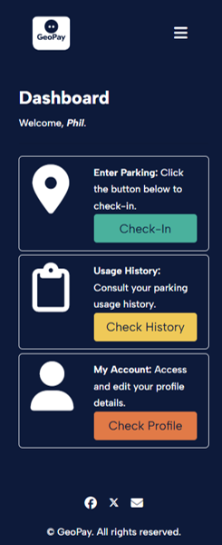</kbd>
</p>

The user dashbaord can be found in `user_management\templates\home\index.html` and is managed by `index()`.

The function first starts by idenifying the user type through `is_parking_customer()`.

If the user_type is Parking Manager, that user will be automatically redirected to their own dashboard, whic his covered in the next section.

`index()` is arguably one of the most central function for the user.

This is from this function that the user can decide to:
* check-in at a parking
* checkout from a parking
* check their transaction history
* access their profile information

The template includes `geolocation.js`, which capture the user's geolocation to match with a potential parking's geofence. This element is discussed further in the **Check-In Parking** section.

Supported by `provide_car_reg.js`, the function also restricts users from checking in, if they havent provided their car registration:

<details>
<summary style="color: white; background: black; padding: 5px;">Click to see code</summary>
<p>

```python
car_reg = False
if request.user.userprofile.car_registration:
    car_reg= True
```
</p>
</details>


### 3.6 Parking Manager Dashboard <a name="parking-manager-dashboard"></a>

The parking manager dashboard provides a dashboard to user_type: Parking Manager.

It is handled by `parking_manager_dashboard()` and can be found on the following path: `parking_management/views.py`.

Similarly to the User Dashboard, the function checks if the user is a parking manager, through `is_parking_manager()`. Failing this test, will redirect the user to User Dashboard.

The dashboard allows the parking manager to have an overview of the `parking_id` that are associated to their account.

From this dashboard, the parking manager can:
* create a new parking object
* check existing parking status
* access each dedicate parking details page

At the bottom of the template, `activate_parking_helper.js` provides a reminder to activate the parking, and how to do it.

A validator prevents the parking manager from deactivating a parking with cars already checked-in.


<details>
<summary style="color: white; background: black; padding: 5px;">Click to see code</summary>
<p>

```python

@require_POST
@login_required
def activate_parking(request, parking_id):
    if not is_parking_manager(request):
        return redirect('home')

    parking = get_object_or_404(Parking, id=parking_id)

    # checks the parking has rates applied
    rate_exist = Rate.objects.filter(parking_name=parking)
    print(rate_exist)
    
    if not rate_exist:
        print('rate_exist is empty')
        messages.error(request, f"Add a rate before activating parking.")
        return redirect('parking-info', parking_id=parking.id)

    has_user = parking_space_available(request, parking_id=parking_id)
    print(f'has_user = {has_user}')
    # prevents parking manager from deleting parking obj
    # when parking users are checked-in
    if has_user != 0:
        messages.error(request, "You cannot deactive parking when users are still checked-in. Contact admin.")
        return redirect('parking-info', parking_id=parking_id)

    # if actiate is true turn it off
    if parking.active:
        parking.active = False
        parking.save()
    # if activate is off turn it on
    else:
        parking.active = True
        parking.save()

    messages.success(request, f"{parking.name} has been {'activated' if parking.active else 'deactivated'}.")
    return redirect('parking-info', parking_id=parking_id)
```
</p>
</details>


<p align="center">
   <kbd>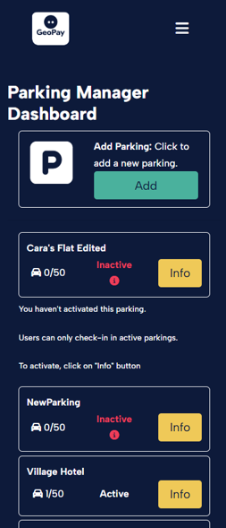</kbd>
</p>


### 3.7 Create Parking<a name="create-parking"></a>

Creating a parking is a feature available only to user type: Parking Manager.

This feature is handled through `create_parking()`.

This feature uses a django for: `ParkingForm()` which looks to populate fields defined in Parking model.

**Important Note**: it is through these field, the geofence is defined. A default radius of 50 meters is applied. This radius should be extended to at least 850 meters if a device other than a mobile phone is used.

**Validators - LatLng:**

With regards to latitude and longitude fields, the form implements a restriction with Regex patterns, and only accepts digits and `-` signs, to ensure values are properly implemented.

<details>
<summary style="color: white; background: black; padding: 5px;">Click to see code</summary>
<p>

```python
class ParkingForm(forms.ModelForm):
    # restricts values in lat lng fields to didgits only
    latitude = forms.CharField(
        validators=[
            RegexValidator(
                regex=r'^([+-]?)((90(\.0{1,9})?)|([1-8]?[0-9])(\.\d{1,9})?)$',  # Allows latitude with up to 9 decimals
                message="Latitude must be a valid number (e.g., -90.0 to 90.0 and up to 9 decimals)."
            )
        ],
        widget=forms.TextInput(attrs={'aria-label': 'Latitude', 'placeholder': 'Enter latitude'})
    )

    longitude = forms.CharField(
        validators=[
            RegexValidator(
                regex=r'^([+-]?)((180(\.0{1,9})?)|((1[0-7][0-9])|([1-9]?[0-9]))(\.\d{1,9})?)$',  # Allows longitude with up to 9 decimals
                message="Longitude must be a valid number (e.g., -180.0 to 180.0 and up to 9 decimals)."
            )
        ],
        widget=forms.TextInput(attrs={'aria-label': 'Longitude', 'placeholder': 'Enter longitude'})
    )
```
</p>
</details>


> [!NOTE]
> Credits - This regex synthax is credited to Stackoverflow post: https://stackoverflow.com/questions/3518504/regular-expression-for-matching-latitude-longitude-coordinates<br>

How does Regex work:
* ^: Defines the start of the string.
* -?: Matches an optional minus sign.
* \d+: Matches one or more digits.
* (\.\d+)?: Optionally matches a decimal point (.) followed by one or more digits.
* $: Defines the end of the string.


**Validators - Mandatory Field:** This form sets all fields as mandatory, in forms.py, with the exception of street_address2 field:


<details>
<summary style="color: white; background: black; padding: 5px;">Click to see code</summary>
<p>

```python
    def __init__(self, *args, **kwargs):
        super().__init__(*args, **kwargs)

        # set all fields as required by default
        for field_name, field in self.fields.items():
            field.required = True

        # make  street_address2 not required
        self.fields['street_address2'].required = False
```

</p>
</details>

Upon success of the form being saved, the user is redirect to the parking_object page managed by `parking_info()`.


### 3.8 Read, Edit & Delete Parking <a name="read-edit-delete-parking"></a>

`parking_info()` handles the management of parking information and takes as a parameter`parking_id`.

This function enables the display of:
* parking status
* number of parking spaces used
* access to Parking Inspector feature
* parking information details and the option to add or edit them 
* rates applicable and the option to add or edit them

**Parking Status**

Parking status advises whether, the `parkind_id` is active or innactive.

For a user to check-in a parking, the parking needs to be `activate`.

Activating and deactivating parking is enabled with `activate_parking()`. Taking `parking_id` as a parameter, it either switch the parking on and off.

<details>
<summary style="color: white; background: black; padding: 5px;">Click to see code</summary>
<p>

```python
    @require_POST
    @login_required
    def activate_parking(request, parking_id):
        if not is_parking_manager(request):
            return redirect('home')

        parking = get_object_or_404(Parking, id=parking_id)

        # checks the parking has rates applied
        rate_exist = Rate.objects.filter(parking_name=parking)
        print(rate_exist)
        
        if not rate_exist:
            print('rate_exist is empty')
            messages.error(request, f"Add a rate before activating parking.")
            return redirect('parking-info', parking_id=parking.id)

        # if actiate is true turn it off
        if parking.active:
            parking.active = False
            parking.save()
        # if activate is off turn it on
        else:
            parking.active = True
            parking.save()

        messages.success(request, f"{parking.name} has been {'activated' if parking.active else 'deactivated'}.")
        return redirect('parking-info', parking_id=parking_id)
```

</p>
</details>

The button that triggers this function on the template under :


<details>
<summary style="color: white; background: black; padding: 5px;">Click to see code</summary>
<p>

```python
    <div class="col">
        <a class="btn button-2 full-width" href="">Info</a>
    </div>
```

</p>
</details>


> [!IMPORTANT]
> Parking objects cannot be activated unless they are provided at least with 1 applicable rate. This rule is set in force in both backend, where the logic will check if the an existing rate has been attached to this `parking_id` and display an error message, and in the front end by hiding the "Activate" button.

<details>
<summary style="color: white; background: black; padding: 5px;">Click to see code</summary>
<p>

```python
    if not rate_exist:
        print('rate_exist is empty')
        messages.error(request, f"Add a rate before activating parking.")
        return redirect('parking-info', parking_id=parking.id)
```

</p>
</details>


**Parking Spaces Available**

Parking spaces available are calculated with the user of `parking_space_available()`, taking `parking_id` as a parameter.

This function counts the number of `Stay` objects, relating to `parking_id` parameter, that have not been marked as paid.

The function returns this value through var `stay_objects_count` to `parking_info()`. 

This variable is then returned on the template in `parking_info.html`, via `parking_info_block.html`.


<details>
<summary style="color: white; background: black; padding: 5px;">Click to see parking_info.html</summary>
<p>

```html
    
        
    
```

</p>
</details>


<details>
<summary style="color: white; background: black; padding: 5px;">Click to see parking_info_block.html</summary>
<p>

```html
    <div class="row d-flex align-items-center justify-content-center">
        <span>
            {{stay_objects_count}}/{{parking.max_capacity}}
        </span>
    </div>
 ```
 
</p>
</details>


**Parking Inspector & Rates**

This feature is covered in a later section.

**Edit and Delete Parking Object**

`edit_parking()` allows parking manager to edit the `parking_id` object by passing the object into `ParkingForm` as an instance to retrieve existing data and edit them.

`delete_parking()`, taking `parkinf_id` as a parameter will allow a parking manager to delete a parking object.

Upon deletion, object associated to parking_id object <b>will not be deleted</b>, as child models are set to `on_delete=models.SET_NULL`.

This is set in place, in order to avoid losing history of transactional data done previously, in particular how rates are calculated, and also illegally parked cars.

Validators were setup in each functions views to prevent parking manager deleting parking objects when users are checked-in.


<details>
<summary style="color: white; background: black; padding: 5px;">Click to see code</summary>
<p>

```python
@login_required
def delete_parking(request, parking_id):
    if not is_parking_manager(request):
        return redirect('home')

    parking = get_object_or_404(Parking, id=parking_id, user=request.user.userprofile)
    
    has_user = parking_space_available(request, parking_id=parking.id)
    print(f'has_user = {has_user}')
    # prevents parking manager from deleting parking obj
    # when parking users are checked-in
    if has_user != 0:
        messages.error(request, "You cannot delete a parking when users are still checked-in.")
        return redirect('parking-info', parking_id=parking.id)

    parking.delete()
    messages.success(request, "Parking deleted.")
    return redirect('parking-manager-dashboard')
```

</p>
</details>
    


**Rates**

Parking Info page displays all applicables rates to selected `parking_id` object.

These rates are created and edited by the parking manager.

### 3.9 Create Parking Rates <a name="create-parking-rates"></a>

Creating parking rates is enabled by `add_rate()`.

Using `RateForm`,(defined in: `parking_management/forms.py`) , it creates a rate object.

The form contains validators ensuring:
* all fields are populated
* rate value is above 0.

<details>
<summary style="color: white; background: black; padding: 5px;">Click to see parking_info_block.html</summary>
<p>

```python
    class RateForm(ModelForm):

        rate_name = forms.CharField(
            required=True, 
            label='', 
            widget=forms.TextInput(attrs={'placeholder': 'Enter rate title'})
        )
        hour_range = forms.IntegerField(
            required=True, 
            label='', 
            widget=forms.NumberInput(attrs={'placeholder': 'Maximum hour until which rate is applicable'}),
            validators=[MinValueValidator(1)]
        )
        rate = forms.DecimalField(
            required=True, 
            label='', 
            widget=forms.TextInput(attrs={'placeholder': 'Enter applicable rate'}),
            validators=[MinValueValidator(0.01)]  # prevents user to under values under or equal to 0 
        )

 ```

</p>
</details>
  

**Note for future development:** It would make sense to allow for the rate to be equal to 0, as some parkings offer free stay during an initial hour range. The current code will need to be modified. Currently, without this validator, stripe will not consider a fee of "0" value as payment. This is probably an easy fix.

The template also contain some javascript, providing a tutorial on how the hourly rate works. 

This logic is further explained in <a name="check-out"> Check-Out Parking </a>

### 3.10 Read, Edit & Delete Parking Rates <a name="read-edit-delete-parking-rates"></a>

Parking rate details are displayed by `parking_info()` through its template.

Editing and deleting an specific `rate_id` is managed by respectively:
* `edit_parking()` (path: `parking_management/views.py`)
* `delete_parking()` (path: `parking_management/views.py`)

Validators were setup in each functions views to prevent parking manager deleting parking objects when users are checked-in.


<details>
<summary style="color: white; background: black; padding: 5px;">Click to see code</summary>
<p>

```python
@login_required
def delete_rate(request, parking_id, rate_id):
    if not is_parking_manager(request):
        return redirect('home')

    has_user = parking_space_available(request, parking_id=parking_id)
    print(f'has_user = {has_user}')
    # prevents parking manager from deleting parking obj
    # when parking users are checked-in
    if has_user != 0:
        messages.error(request, "You cannot edit rate when users are still checked-in. Contact admin.")
        return redirect('parking-info', parking_id=parking_id)
        
    rate = get_object_or_404(Rate, id=rate_id)
    rate.delete()
    messages.success(request, "Rate deleted.")
    return redirect('parking-info', parking_id=parking_id)
 ```

</p>
</details>


<p align="center">
   <kbd>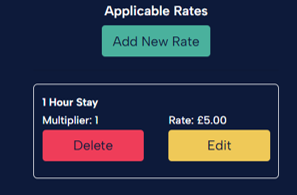</kbd>
</p>

### 3.11 Check-In Parking : Geolocation <a name="check-in"></a>

This section is managed by parking_activity app.

The check-in process starts from the user dashboard.

The function first checks if the user has provided their car registration number. If not, it will prompt the user to do so, before moving any further.

From this point, the check-in process can be divided into 3 phases:

**Phase 1 - Capturing User Geolocation**

If the user profile has a car registration number, the user will be able to access the "Check-In" button. By clicking the button `getLocation()` triggers which will populate 2 hidden inputs. `getLocation()` is a javascript function managed by `geolocation.js` (path: static/js/geolocation.js)


<details>
<summary style="color: white; background: black; padding: 5px;">Click to see parking_info_block.html</summary>
<p>

```python
    <div class="col-12 col-md-4 mt-3 mt-md-0">
        <form action="" class="w-100" method="POST">
            
            <input type="hidden" id="userLatitude" name="latitude" value="">
            <input type="hidden" id="userLongitude" name="longitude" value="">
            <button type="submit" class="btn button-1 w-100" onclick="getLocation()">
                <span>Check-In</span>
            </button>
        </form>
    </div>
```

</p>
</details>


These two hidden inputs will capture the user's latitude and longitude.

Once captured, the templates form logic will trigger `get_parking_location()`.

The role of `get_parking_location()` is to look for a matching geolocation between the user, and a potential parking.

In order to do so, `get_parking_location()` collects the values in `user_latitude` and `user_longitude` variables which are fed by the hidden input fields populate by the javascript function.

```python
    if request.method == "POST":
        # capture user current location
        user_latitude = request.POST.get('latitude')
        user_longitude = request.POST.get('longitude')
        print(f'user_latitude = {user_latitude}')
        print(f'user_longitude = {user_longitude}')
```

> [!NOTE]
>Credits -  `getLocation()` is a copy of `HTML Geolocation API` from W3Schools (https://www.w3schools.com/html/html5_geolocation.asp
)

**Phase 2 - Capturing Matching Parking Geolocation**

If these two variables have values against them, the function will then proceed to: 
* set the user location in a tuple
* list all activate parking objects and look for matching geolocation, taking into account their respective radius value, defined in each parking object.

At the end of this process, the logic will either return a `parking_id` or nothing. 

The `parking_id` is then passed as a parameter in `enter()`.

In the event, no parking_id could be returned, `parking_id` is set as None by default in `enter()`.

**views.py:**

```python
    @login_required
    def enter(request, parking_id=None):
        ...
```

**urls.py:**

```python
    path('enter/', views.enter, name='enter'),
    path('enter/<int:parking_id>/', views.enter, name='enter_with_parking_id'),
```

> [!NOTE]
> Credits - HTML Geolocation API: https://www.w3schools.com/html/html5_geolocation.asp

> [!TIP]
> `Uncaught TypeError: Cannot set properties of null (setting 'innerHTML')`. This occurs when the script is loaded at the beginning of the template, before the element exists.
>
> This problem was solved by moving the JS file to the bottom of the `<body>` in the `index.html` template:
>
> ```html
> 
>     ...
> 
>
> 
>     <script src=""></script>
> 
> ```


> [!TIP]
> `TypeError: float() argument must be a string or a real number, not 'set'`: following Igor-S answer on stackoverflow, I encountered this error.
> This is because of the use of `({})`, which in Python define a set, rather than parentheses `()`.
> To fix this error by converting the values into `float`:
> ```python   
>    user_location = (float(user_latitude), float(user_longitude))
>```

> [!TIP]
>`TypeError: '<=' not supported between instances of 'float' and 'str'`: following the above mentioned example provided on stackoverflow.
>This error happened because `parking.radius` is a string and `locations_distance` is a float.
>```python
>    if locations_distance <= parking_radius:
>        print(f'You are in {parking.name}')
>    else:
>        print(f'You are not in {parking.name}')
>```

Set values in the same format:

```python
    parking_radius = float(parking.radius)
```

> [!TIP]
>`TypeError: User geolocation innacuracy: unless a mobile phone is used for testing, the accuracy of the geolocation varies between 3m to 888m. I found that from my laptop a range of 900m was comfortable to capture a nearby geofence.
> For mobile phone, I had 100% success with a radius set at 50 meters.

**Phase 3 - Validating User Consent to Check-In**

This is the last phase of the check-in process and is managed by both a python and javascript functions. Respectively:
* `enter()`
* `fetchRates()`

If a `parking_id` was provided as a parameter, `enter()` will prompt the user to:
* confirm they are happy to check-in at the identified parking. 
* automatically display the applicable rate to said `parking_id`.

As it had to be generated dynamically, taking into account that no `parking_id` parameters could be passed, the task of displaying applicable rates was assigned to `parking_fee.js`.

Through `parking_fee.js`, `fetchRates()` collects dynamically applicables rates from selected parking form the database, by using `get_parking_rates()` (views.py).


<details>
<summary style="color: white; background: black; padding: 5px;">Click to see `get_parking_rates()`</summary>
<p>

```python
    def get_parking_rates(request, parking_id):
        print(f'get_parking_rates parking id = {get_parking_rates}')
        rates = Rate.objects.filter(parking_name_id = parking_id).values(
            'rate_name',
            'hour_range',
            'rate',
        )
        return JsonResponse(list(rates), safe=False)
```

</p>
</details>
    

`get_parking_rates()`is an API that collects Rate model objects relevant to the `parking_id` the user is checking-in from.

These objects are then returned back to `fetchRates()` in json format, before being rendererd in a table through `renderRatesTable()`.

<p align="center">
   <kbd>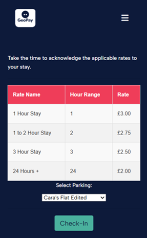</kbd>
</p>


<details>
<summary style="color: white; background: black; padding: 5px;">Click to see `renderRatesTable()`</summary>
<p>

```python
    function renderRatesTable(data){

        // get the body of the table
        const table = document.getElementById("ratesTable");
        const tbody = document.querySelector("table tbody")
        tbody.innerHTML = "";

        if(data.length>0){
            
            // shows table
            table.style.display ="table"
            // Adds data to table rwos

            data.forEach(rate=>{
                const tableRow = document.createElement('tr');
                tableRow.innerHTML = `
                <tr>
                    <td>${rate.rate_name}</td>
                    <td>${rate.hour_range}</td>
                    <td>£${rate.rate}</td>
                </tr>
                `;
                tbody.appendChild(tableRow);
            });
        }else{
            table.style.display = "none"
        }
    }

```

</p>
</details>
    

> [!TIP]
> The initial code was returning an error. It seems that Json expects a dictionaryy by default. To correct this problem `safe` is set to `False` (`safe = False`), which allows to return a list instead.


**What happens if `parking_id` is None as a parameter?**

As mentioned at the end of the previous Phase, `enter()` can expect a `parking_id` parameter, but this is not mandatory.

This last section covers the possibility that geolocation might fail, or the user simply did not enable it on their phone. 

In this case we still want the user to be able to check-in through a manual step.

If `parking_id` is not provided as a parameter, the user is offered to select the parking they are looking to check-in from through a drop down menu.

This drop down menu is generated in the template:


<details>
<summary style="color: white; background: black; padding: 5px;">Click to see template form</summary>
<p>

```python
    <form method="post">
        
        <div class="enter-form center">
            <label for="parking-select">Select Parking:</label><br>
            <select id="parking-select" name="parking_name">
                <option value="">Select parking</option>
                
                    <option value="{{ parking.id }}" 
                        
                            selected
                        >
                        {{ parking.name }}
                    </option>
                
            </select>
        </div>
        <hr>
        <div class="enter-submit-button center">
            <input class="button-1 btn " type="submit" value="Check-In">
        </div>
    </form>
```

</p>
</details> 

Upon selection by the user the `parking_id` is captured by an event listener, which will return the parking rates against the selected `parking_id`, using `get_parking_rates()` and the process previously mentioned.


<details>
<summary style="color: white; background: black; padding: 5px;">Click to see script</summary>
<p>

```python
    // look for changes if the user has selected a parking manually
    const manuallySelectedParking = document.getElementById('parking-select');
    console.log("manuallySelectedParking=", manuallySelectedParking);

    if(manuallySelectedParking){
        manuallySelectedParking.addEventListener('change', function(){
            console.log("this is getting accessed")
            parkingId = this.value || "null";
            console.log(`Updated parking id is ${parkingId}`);
            // only trigger fetchRates() if parking_id is not null
            // to avoid 404 error in console
            if (parkingId !== "null"){
                fetchRates();
            }
            
        })

    }
```

</p>
</details>

**Phase 4 Check-in Form**

This final phase is managed by `enter()` which handles both scenarios of having the `parking_id` provided as a parameter, or provided later on upon manual selection by the user.

**Suggestion for future improvement**: there is one scenario that this project does not cover, is the pssibility of the user being geolocated within an incorrect parking, especially if 2 parking radiuses are overlaping. It would make sense to add a possibility for the user to override the `parking_id` parameter through manual selection.

> [!IMPORTANT]
> The check-in process was by far the most challenging part of the project. A big acknowledgment to Gareth McGirr and Stackoverflow for the help.

> [!NOTE]
> Credits - Gareth Mc Girr (mentor) who guided through this process<br>
> Credits - Stackoverflow: https://dev.to/chryzcode/django-json-response-safe-false-4f9i

### 3.12 Check-Out Parking <a name="check-out"></a>

Similarly to the check-in process, the check-out process starts from index template (index.html).

After checking-in, the user is redirect to `index.html`, with a slight change to the previous screen.

Instead of displaying "Check-In" button, the user is now presented with "Check-out" button instead.

The display management of these two buttons is hanlded in `index()` through var `existing_stay_obj`:
* the variable returns the latest Stay model object created with an empty Leave field.


<details>
<summary style="color: white; background: black; padding: 5px;">Click to see code</summary>
<p>

```python
    #look up if user has already an existing Stay object
    #and exclude objects that is matched with a LeaveParking object 
    existing_stay_obj = Stay.objects.filter(user=request.user.userprofile).exclude(
        id__in=LeaveParking.objects.values_list('stay_id', flat=True)
    )
```

</p>
</details>

If var `existing_stay_obj` exists, the template will return a button redirecting the user to `leave()` (checkout) with `stay_id` as parameter. 

Otherwise a button leading to `enter()`(check-in) is displayed.

This entire section is managed by `leave()`, which handles the relationships between other functions.

**Phase 1 - User Stay Duration Calculation**

Using the `stay_id` parameter, it creates a LeaveParking objects, child to its Stay model object.


<details>
<summary style="color: white; background: black; padding: 5px;">Click to see code</summary>
<p>

```python
    # Retrieve the existing Stay object
    try:
        stay = Stay.objects.get(id=stay_id, user=request.user.userprofile)
        print(f'stay id = {stay}')
        # Create a LeaveParking entry
        leave_parking = LeaveParking.objects.create(
            user=request.user.userprofile,
            parking_name=stay.parking_name,
            stay=stay,
        )
```

</p>
</details>

The newly created object also contained a timestamp field, which is automatically populated upon creation.

Following successful creation of the leave object, `leave()` proceeds to collect both timestamp from EnterParking and LeaveParking childs objects to `stay_id`.

The function will then compare both timestamps to extract the user's stay duration in var `total_stay_time_hours`.


<details>
<summary style="color: white; background: black; padding: 5px;">Click to see code</summary>
<p>

```python
    #retrieve enter timestamp
    enter_time = EnterParking.objects.get(stay=stay_id)
    print(f'enter_time = {enter_time.timestamp_enter}')

    #retrieve leave timestamp
    exit_time = LeaveParking.objects.get(stay=stay_id)
    print(f'exit_time = {exit_time.timestamp_leave}')

    #difference between enter and leave time
    total_stay_time = exit_time.timestamp_leave - enter_time.timestamp_enter
    print(f'total_stay_time = {total_stay_time}')

    # Convert total_stay_time to hours
    total_stay_time_hours = Decimal(total_stay_time.total_seconds()) / Decimal(3600)
    print(f'total_stay_time in hours = {total_stay_time_hours}')
```

</p>
</details>

Var `total_stay_time_hours` is then used to calculte the applicable fee.

```python
    applicable_fee = calculate_user_fee(stay, total_stay_time_hours)
```

**Phase 2 - User Fee calculation**

This phase is managed by `calculate_user_fee()`.

It takes both the `stay` model object and `total_stay_time_hours` as parameters, from `leave()`.

The function starts by rounding up `total_stay_time_hours` to next hour : if a user stayed 1.5 hour, `total_stay_time_hours` will be equal to 2.

Following this steps, the applicable rates to relevant parking objects are identified.

<details>
<summary style="color: white; background: black; padding: 5px;">Click to see code</summary>
<p>

```python
    #look for applicate rate for parking ID and total stay again rate.hour_range
        rate_available = Rate.objects.filter(parking_name=stay.parking_name).order_by('hour_range')
        print(f'rate_available = {rate_available}')
```

</p>
</details>

Once these rates are identified, the functions proceeds to match the appropriate hourly rate to `total_stay_time_hours`, and return the value into variable `closest_rate`.


<details>
<summary style="color: white; background: black; padding: 5px;">Click to see code</summary>
<p>

```python
    #return applicable fee
    #create variable to attach closest rate to it during loop
    closest_rate = None
    for rate in rate_available:
        print(f'rate_available = Hour range:{rate.hour_range}; Rate:{rate.rate}')
        if total_stay_time_hours <= Decimal(rate.hour_range):
            closest_rate = rate
            break 
    
    #if the user stayed longer than longest rate
    #apply the latest rate on the list
    if closest_rate is None and rate_available.exists():
        closest_rate = rate_available.last()
```

</p>
</details>

Once `closest_rate` is defined, the applicable fee can be calculated and returned to `leave()` under variable: `applicable_fee`.

<details>
<summary style="color: white; background: black; padding: 5px;">Click to see code</summary>
<p>

```python
    if closest_rate:
        print(f'closest rate is {closest_rate}')
        applicable_fee = closest_rate.rate * roundedup_total_stay_time_hours
        print(f'applicable_fee = {applicable_fee}')
        return (applicable_fee)
    else:
        print('Looks like there is a problem!')
        return None
```

</p>
</details>

**Phase 3 - Fee Form**

This phase is handled by `fee_form()` and managed by `leave()`, passing `applicable_fee` and `stay_id` as parameters. 

<details>
<summary style="color: white; background: black; padding: 5px;">Click see to leave() code section redirecting to fee_form()</summary>
<p>

```python
    if applicable_fee:
        print(f'applicable_fee is {applicable_fee}')
        fee_form(request, applicable_fee, stay_id)
        return payment(request,applicable_fee, stay_id)
    else:
        print(f'no applicable fee')
```

</p>
</details>

The role of this function is retrieve the stay object id, and add the calculated fee to it, before redirecting the user back to `leave()` for payment handling.

<details>
<summary style="color: white; background: black; padding: 5px;">Click to fee_form() code</summary>
<p>

```python
    # add Fee value to stay_id
    @login_required     
    def fee_form(request, applicable_fee,stay_id ):
        try:
            stay = Stay.objects.get(id=stay_id)
            stay.calculated_fee = applicable_fee
            stay.save()
            print(f"Stay object {stay_id} updated with calculated_fee: {stay.calculated_fee}")
        except Stay.DoesNotExist:
            print('Stay object does not exist')  
```

</p>
</details>


### 3.13 Stripe Payment Integration <a name="stripe"></a>

**Phase 1 - Payment**

Following succesful completion of `fee_form()`, the user is returned to `leave()` for payment handling.

Payment handling is managed through a Stripe integration, which is detailed below.

The Payment handling process starts from `payment()`, taking `applicable_fee`, `stay_id` as parameters.

The function will start by collecting the `STRIPE_SECRET_KEY_TEST` from .env file, and set `applicable_fee` from pence to pounds. 


<details>
<summary style="color: white; background: black; padding: 5px;">Click to see code</summary>
<p>

```python
    #set API key the begining to avoid 
    #"Error in payment process:No API key provided."
        stripe.api_key = settings.STRIPE_SECRET_KEY_TEST
        amount_int = int(applicable_fee*100)
```

</p>
</details>

The function looks for existing stripe ID, in the UserProfile model object.

<details>
<summary style="color: white; background: black; padding: 5px;">Click to see code</summary>
<p>

```python
    #check if userprofile already has a stripe id
    # Create a customer if not already created
        if not request.user.userprofile.stripe_customer_id:
            customer = stripe.Customer.create(
                email=request.user.email
            )
            request.user.userprofile.stripe_customer_id = customer.id
            request.user.userprofile.save()
 ```

</p>
</details>

A local variable `price_object` is defined. The role of this variable is to create object in Stripe for future use.

<details>
<summary style="color: white; background: black; padding: 5px;">Click to see code</summary>
<p>

```python
    #create a price object in stripe
        price_object = stripe.Price.create(
            unit_amount=amount_int,
            currency="gbp",
            product_data={
                "name":"Parking Fee"
            }
        )
```

</p>
</details>

Following the successful completion of `fee_form()`, the user is returned to `leave()` for payment handling.

Payment handling is managed through a Stripe integration, detailed below.

The process starts with the `payment()` function, which takes `applicable_fee` and `stay_id` as parameters. This function begins by retrieving the `STRIPE_SECRET_KEY_TEST` from the `.env` file and converting the `applicable_fee` from pounds to pence (as required by Stripe). 

<details>
<summary style="color: white; background: black; padding: 5px;">Click to see code</summary>
<p>

```python
    # Set API key to avoid "No API key provided" error
    stripe.api_key = settings.STRIPE_SECRET_KEY_TEST
    amount_int = int(applicable_fee * 100)  # Convert pounds to pence
```
</p> </details>

The function checks if the user has an existing Stripe customer ID in their profile (UserProfile model). If not, it creates a new customer on Stripe and saves the ID to the user's profile.

<details> <summary style="color: white; background: black; padding: 5px;">Click to see code</summary> <p>

```python
    if not request.user.userprofile.stripe_customer_id:
        customer = stripe.Customer.create(
            email=request.user.email
        )
        request.user.userprofile.stripe_customer_id = customer.id
        request.user.userprofile.save()
```
</p> </details>

A price_object is created to represent the payment amount and currency on Stripe. This object is essential for generating the checkout session.

<details> <summary style="color: white; background: black; padding: 5px;">Click to see code</summary> <p>

```python
    price_object = stripe.Price.create(
        unit_amount=amount_int,  # Amount in pence
        currency="gbp",          # British Pounds
        product_data={
            "name": "Parking Fee"
        }
    )
```
</p> </details>

After creating the price_object, a Stripe checkout session is initialized. The session includes the price details, payment method options, and success or cancellation URLs. Stripe returns the user to these URLs based on payment status.

<details><summary style="color: white; background: black; padding: 5px;">Click to see code</summary> <p>

```python
    checkout_session = stripe.checkout.Session.create(
        payment_method_types=['card'],
        line_items=[{
            'price': price_object.id,
            'quantity': 1,
        }],
        mode='payment',
        customer=request.user.userprofile.stripe_customer_id,
        success_url=settings.REDIRECT_DOMAIN + 'parking_activity/payment_successful?session_id={CHECKOUT_SESSION_ID}',
        cancel_url=settings.REDIRECT_DOMAIN + 'parking_activity/payment_cancelled',
    )
```
</p> </details>

Finally, the stay_id model object is updated with the Stripe checkout session ID for tracking, and the user is redirected to the Stripe-hosted checkout page.

<details> <summary style="color: white; background: black; padding: 5px;">Click to see code</summary> <p>

```python
    stay = Stay.objects.get(id=stay_id)
    stay.stripe_checkout_id = checkout_session.id
    stay.save()

    return redirect(checkout_session.url)
```
</p> </details>


**Phase 2 - Payment Confirmation (Stripe Webhook)**

Following successful payment, the user recieves an email confirmation.

This process is managed by `stripe_webhook()`.

After successful payment, Stripe will send a query back to the server and starts with a few validation.


<details>
<summary style="color: white; background: black; padding: 5px;">Click to see code</summary>
<p>

```python
    @csrf_exempt
    def stripe_webhook(request):

        print("enter webhook")
        stripe.api_key = settings.STRIPE_SECRET_KEY_TEST
    
        payload = request.body
        signature_header = request.META.get('HTTP_STRIPE_SIGNATURE')
        webhook_secret = settings.STRIPE_WEBHOOK_SECRET_TEST
        event = None
        try:
            event = stripe.Webhook.construct_event(
                payload, signature_header, webhook_secret
            )
        except ValueError as e:
            print(f"Invalid payload: {str(e)}")  # Log the error for debugging
            return HttpResponse(status=400)
        except stripe.error.SignatureVerificationError as e:
            print(f"Signature verification failed: {str(e)}")  # Log the error for debugging
            return HttpResponse(status=400)
        ...
```

</p>
</details>


Following successful validation, Stripe will look to push payment confirmation to the server, updating the `stay_id` object from False to True.

<details>
<summary style="color: white; background: black; padding: 5px;">Click to see code</summary>
<p>

```python
    # retrieve user payment record
    stay = Stay.objects.get(stripe_checkout_id=session_id)
    line_items = stripe.checkout.Session.list_line_items(session_id,limit=1)
    stay.paid = True
    stay.save()
```

</p>
</details>


Successful confirmation will eventually trigger an payment confirmation email being sent to the user.

<details>
<summary style="color: white; background: black; padding: 5px;">Click to see code</summary>
<p>

```python
    subject = "Payment Confirmation"
                context = {
                    'username': stay.user.user.username,
                    'stripe_checkout_id': stay.stripe_checkout_id,
                    'transaction_id': stay.id,
                    'amount_paid': stay.calculated_fee,
                    'parking_name': stay.parking_name.name,
                }

                # prepare email
                message = render_to_string('email/payment_confirmation_email.html', context)
                email_reciever = stay.user.user.email

                # send email
                try:
                    send_mail(
                        subject,
                        message,
                        settings.DEFAULT_FROM_EMAIL,
                        [email_reciever],
                        html_message=message,
                        fail_silently=False,
                    )
                    logger.info('Email sent successfully')
                except Exception as e:
                    logger.error('Error sending email: %s', str(e))
                print('email is sent')
 ```

</p>
</details>

<p align="center">
   <kbd>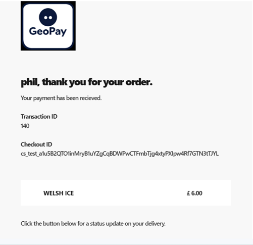</kbd>
</p>


> [!TIP]
>`TypeError: `stripe_webhook not found`. As my webhook view in not included in my main app, the console logs were showing a failed attempt at retrieving `stripe_webhook` path. The issue was solved by adding the name to the webhook path in the Stripe platform: `https://[domain-name]/parking_activity/stripe_webhook/`. 

> [!NOTE]
> Overall Stripe Integration: The tutorial provided by the course material wasnt adapted to what I was looking for. Instead I followed the tutorial from this video (https://www.youtube.com/watch?v=hZYWtK2k1P8&t=1s) and made a number of changes to suit my project.<br>
> `stripe_webhook not found`: The solution was brough to me by RyanM on Stackoverflow after I posted my question: https://stackoverflow.com/questions/79256457/django-stripe-webhook-not-found/79256537#79256537 <br>


### 3.14 Crispy Forms <a name="cripsy"></a>

The improve the layout of the forms, the project includes the use of crispy forms.

**Implementation steps**:
* Run `pip install django-crispy-forms`
* Run `pip install crispy-bootstrap5`


* In Installed_apps (**Settings.py**) add:

    ```python
    INSTALLED_APPS = [
        'django.contrib.admin',
        ...
        #crispy form packages
        'crispy_forms',
        'crispy_bootstrap5',

    ]
    ```
* In Settings.py, add:

```python
    CRISPY_TEMPLATE_PACK = 'bootstrap5'
```

* add to template:

```html
    
```

* add to form fields:

```html
    {{ variable|as_crispy_field }}
```

> [!NOTE]
> Credits - Documentation: https://django-crispy-forms.readthedocs.io/en/latest/


### 3.15 Decorators <a name="decorators"></a>

The project makes a thorough of of the login_required decorator.

It allows to force a user to be authenticated before accessing a specific function and related template.

With the exception of login and register templates, all other function have a decorator.

```python
    from django.contrib.auth.decorators import login_required

        @login_required
        def index(request):
        ...
```

Other decorators in use: 
* `@csrf_exempt` - to remove the need for CSRF token in Stripe callback
* `@require_POST` - restricts a view to only accept POST methods 

> [!NOTE]
> Credits - Documentation: https://docs.djangoproject.com/en/5.1/topics/http/decorators/


### 3.16 Custom Error Handlers <a name="error-handler"></a>

The project implements custom error handlers, allowing to gracefully handle potential error communicated by the browser to the user.

Custom templates list:
* 404 error
* 500 error
* 403 error
* 400 error

Templates are located in: `user_management\templates\errors`

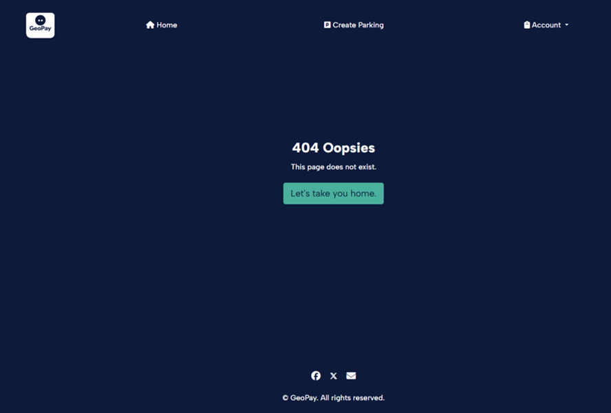

<details>
<summary style="color: white; background: black; padding: 5px;">Click to see code for urls.py (project level)</summary>
<p>

```python
    from django.conf.urls import handler404, handler500, handler403, handler400

    urlpatterns = [....
    ] 

    handler404 = 'user_management.views.handler404'
    handler500 = 'user_management.views.handler500'
    handler403 = 'user_management.views.handler403'
    handler400 = 'user_management.views.handler400'
 ```

</p>
</details>

<details>  
<summary style="color: white; background: black; padding: 5px;">Click to see code for views.py (app level)</summary>
<p>

```python
    def handler404(request, exception):
        """ Handle 404 errors and render the custom 404 error page """
        return render(request, 'errors/404.html', status=404)


    def handler500(request):
        """ Handle 500 errors and render the custom 500 error page """
        return render(request, 'errors/500.html', status=500)


    def handler403(request, exception):
        """ Handle 403 errors and render the custom 403 error page """
        return render(request, 'errors/403.html', status=403)


    def handler400(request, exception):
        """ Handle 400 errors and render the custom 400 error page """
        return render(request, 'errors/400.html', status=400)


    def test_500_error(request: HttpRequest):
        """ Raise a test exception for the 500 error handler """
        raise Exception("Test 500 error")


    def test_403_error(request):
        """ Raise a test exception for the 403 error handler """
        raise PermissionDenied("Test 403 error")


    def test_400_error(request):
        """ Raise a test exception for the 400 error handler """
        raise SuspiciousOperation("Test 400 error")
  ```

</p>
</details>

### 3.17 Parking Inspector <a name="parking-inspector"></a>

This feature is mostly managed through `parking_inspector()` and allows the parking manager to see the state of their parkings and check if all vehicles in the parking have check-in the app.

For those that are not checked-in, the parking manager has an option to record the registration plate of the illegally parked car.

The list can then be used to send Parking Charge Notices from a different system.

Currently the parking manager can:
* See checked-in cars
* Add illegally parked cars
* Delete illegally parked cars (`delete_car_reg()`)


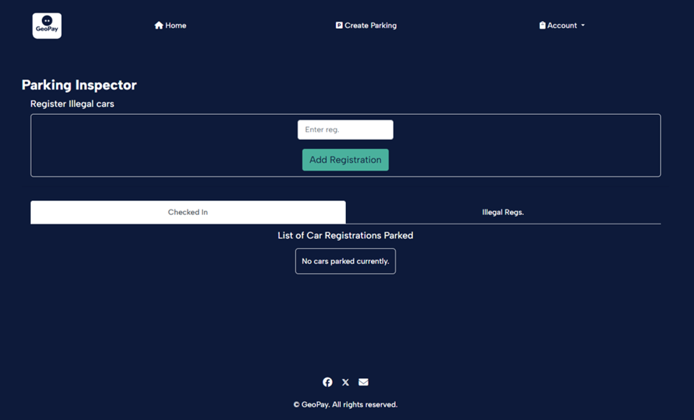

**Future improvements:**

* This feature could benefit from immediate improvement such as the possibility to take a picture of the car and upload on the S3 Bucket for proof. This feature is not implemented yet.
* Another feature could be to accelerate the detection of illegally parked cars by integration Optical Character Recognition (Optical Character Recognition). This feature could be implemented by using django progressive web app extension. This would allow the parking manager to simply scan each car registration and let the GeoPay look in the database if the parked as checked-in. 

### 3.17 Back Button <a name="back-button"></a>

The project includes a back button, in `base.html`.

This back button has two features:
* It redirects the user back to the previous page using the user history :`onClick="javascript:history.go(-1)`
* It is hidden on index and parking_manager_dashboard pages using `request.path`
* It also redirects to a different page on certain cases when the previous page is likely to be a form.

<details>
<summary style="color: white; background: black; padding: 5px;">Click to see code details</summary>
<p>

```python
    
        <div class="navigation">
        <!-- If user is on user account, redirects home -->
        
            <a href="">
                <i class="fa fa-arrow-left" aria-hidden="true"></i> Back
            </a> 
        <!-- Back buttons is index after succesful payment -->
        
            <a href="">
                <i class="fa fa-arrow-left" aria-hidden="true"></i> Back
            </a> 
        
            <a href="">
                <i class="fa fa-arrow-left" aria-hidden="true"></i> Back
            </a> 
        
            <a href="">
                <i class="fa fa-arrow-left" aria-hidden="true"></i> Back
            </a> 
        <!-- not the above options and not listed in path below: redict to previous page -->
        
            <a onClick="javascript:history.go(-1)">
                <i class="fa fa-arrow-left" aria-hidden="true"></i> Back
            </a> 
        
        </div>
    
```

</p>
</details>

The credits for this feature goe to the links listed below.

> [!NOTE]
> Credits - Back button - https://stackoverflow.com/questions/524992/how-to-implement-a-back-link-on-django-templates<br>
> Credits - Excluding pages from button display - https://stackoverflow.com/questions/41129551/django-creating-an-if-statement-based-on-the-request-path-not-working<br>
> Credits -  `request.resolver_match` : https://medium.com/@iamalisaleh/how-to-get-the-current-url-within-a-django-template-8270b977f280<br>

Suggestion for improvement: The code could improve by streamlining the series of `elif` statement into a single `if`. For some reason the below code was generating an error.

```html
    
        <a href="">
            <i class="fa fa-arrow-left" aria-hidden="true"></i> Back
        </a>
    
    ...
    
```

## 4. Technologies <a name="tech"></a>

* Django & Python are used for both backend and frontend.
* HTML : for front endrendering.
* CSS : for front endrendering.
* Bootstrap : for front endrendering.
* JavaScript : for both backend and frontend.
* PostgreSQL : for data storing.
* VSCode :  used to write and edit code.
* Git : used for version control.
* GitHub : used to host version controls online.
* Heroku : used to host PostGres database online.
* WhiteNoise : used for serving static files with Heroku.
* AWS S3 Bucket used for online media file storage.
* Stripe used payment processing.
* Gmail API used for sending emails in my application.
* Pixso used for wireframes.
* Midjourney used for logo generation.
* ICO Converter was used to compress images and convert them into .webp.
* Chrome Developer Tools used to debug, test responsiveness, and generate Lighthouse reports.
* Google Fonts was used to import fonts for the site.
* Font Awesome was used for all the site icons.
* W3C HTML Validator was used to validate the HTML code.
* W3C CSS Validator was used to validate the CSS code.
* JSHint was used to detect errors and potential problems in JavaScript code.
* Notion : for generation of tables in md format

## 5. Testing <a name="testing"></a>
### 5.1 Validator Testing <a name="val-testing"></a>
#### 5.1.1 HTML <a name="html"></a>

The HTML tests are returning errors and warnings in relations to Django's synthax:
* Adding `lang` attribute: this is added to `base.html`
* Starting document with `<!DOCTYPE html>`: this element is also present in `base.html`
* Element `<head>` is missing: this is also provided in `base.html`

<details>
    <summary style="color: white; background: black; padding: 5px;">check_in_info_block.html</summary>
    <p>
        <kbd>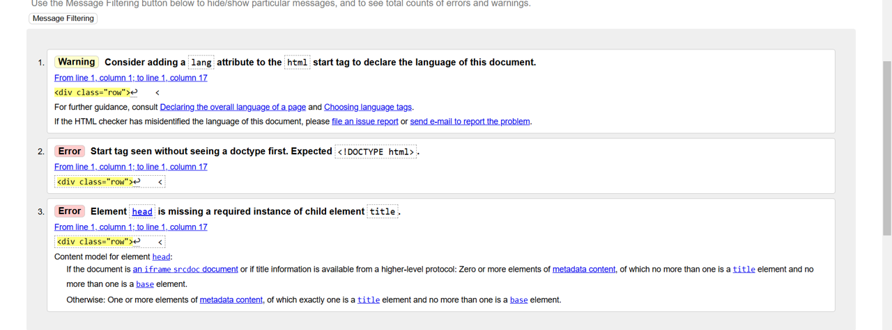</kbd>
    </p>
</details>

<details>
    <summary style="color: white; background: black; padding: 5px;">check_out_info_block.html</summary>
    <p>
        <kbd>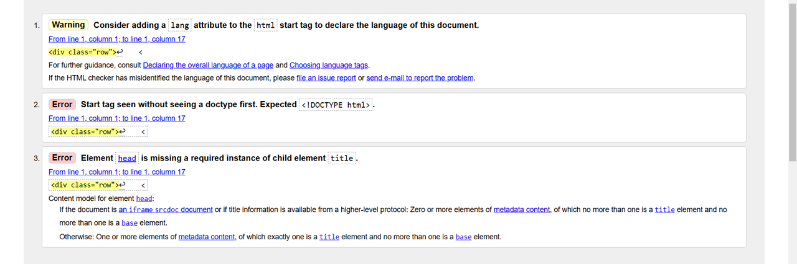</kbd>
    </p>
</details>

<details>
    <summary style="color: white; background: black; padding: 5px;">fee_info_block.html</summary>
    <p>
        <kbd>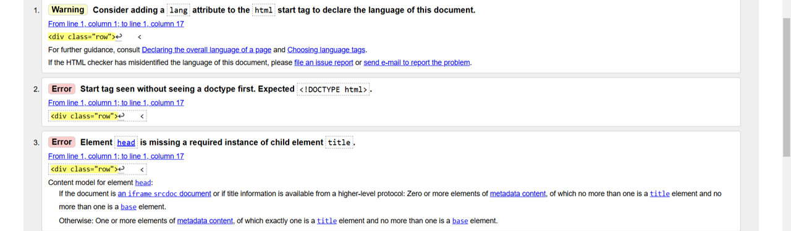</kbd>
    </p>
</details>

<details>
    <summary style="color: white; background: black; padding: 5px;">parking_name_block.html</summary>
    <p>
        <kbd>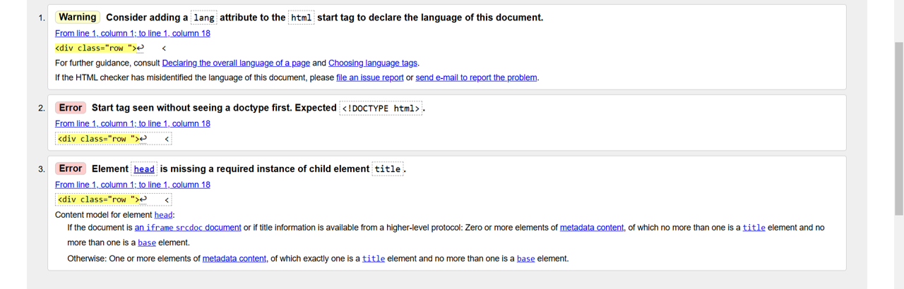</kbd>
    </p>
</details>

<details>
    <summary style="color: white; background: black; padding: 5px;">transaction_id_block.html</summary>
    <p>
       <kbd>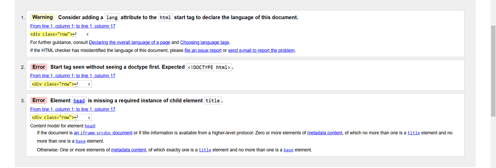</kbd>
    </p>
</details>

<details>
    <summary style="color: white; background: black; padding: 5px;">history.html</summary>
    <p>
        <kbd>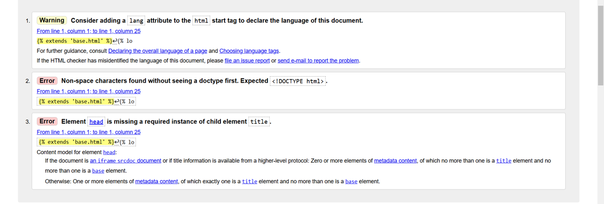</kbd>
    </p>
</details>

<details>
    <summary style="color: white; background: black; padding: 5px;">payment_cancelled.html</summary>
    <p>
        <kbd>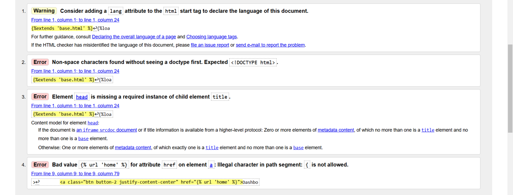</kbd>
    </p>
</details>

<details>
    <summary style="color: white; background: black; padding: 5px;">payment_successful.html</summary>
    <p>
       <kbd>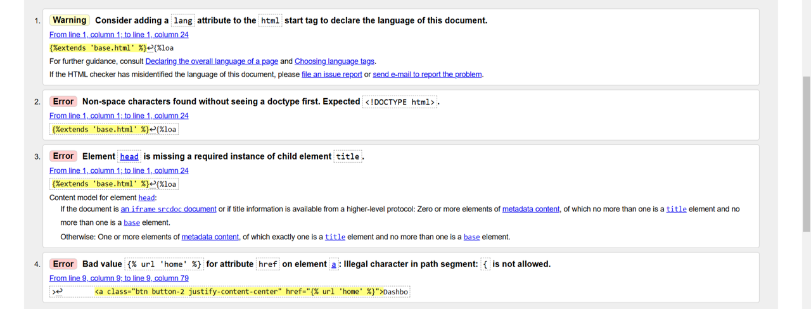</kbd>
    </p>
</details>

<details>
    <summary style="color: white; background: black; padding: 5px;">check_in_block.html</summary>
    <p>
        <kbd>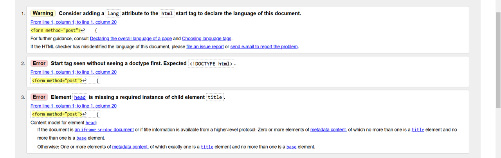</kbd>
    </p>
</details>

<details>
    <summary style="color: white; background: black; padding: 5px;">enter_parking_manually_block.html</summary>
    <p>
        <kbd>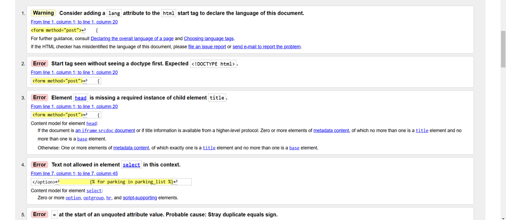</kbd>
    </p>
</details>

<details>
    <summary style="color: white; background: black; padding: 5px;">instructions_block.html</summary>
    <p>
        <kbd>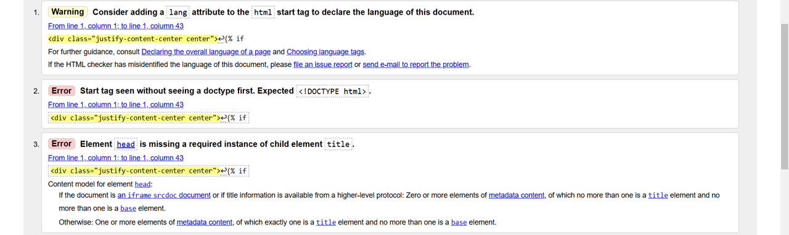</kbd>
    </p>
</details>

<details>
    <summary style="color: white; background: black; padding: 5px;">parking_rates_block.html</summary>
    <p>
        <kbd>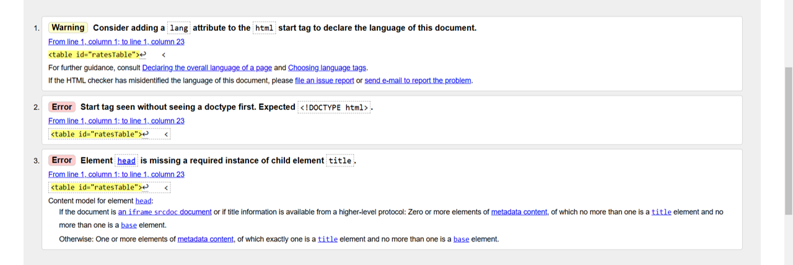</kbd>
    </p>
</details>

<details>
    <summary style="color: white; background: black; padding: 5px;">enter.html</summary>
    <p>
        <kbd>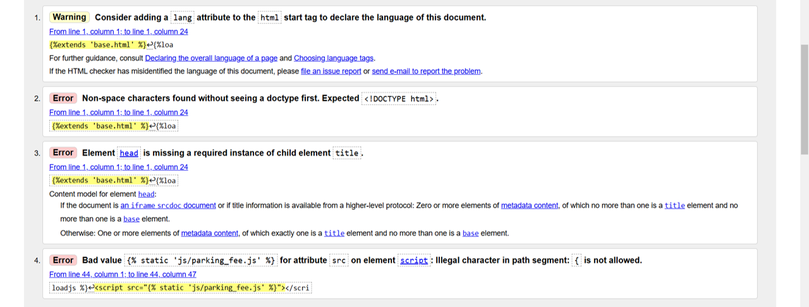</kbd>
    </p>
</details>

<details>
    <summary style="color: white; background: black; padding: 5px;">create_parking_block.html</summary>
    <p>
        <kbd>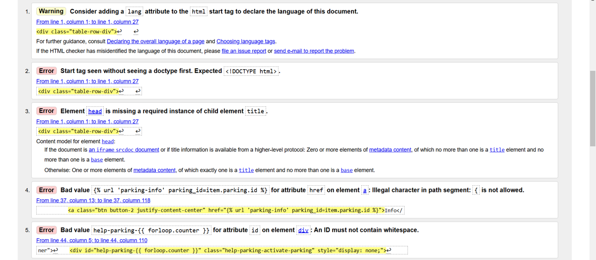</kbd>
    </p>
</details>

<details>
    <summary style="color: white; background: black; padding: 5px;">manager_dashboard_block.html</summary>
    <p>
        <kbd>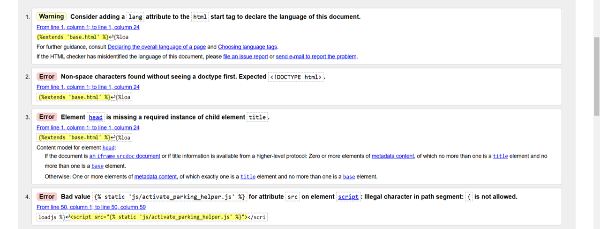</kbd>
    </p>
</details>

<details>
    <summary style="color: white; background: black; padding: 5px;">create_parking.html</summary>
    <p>
        <kbd>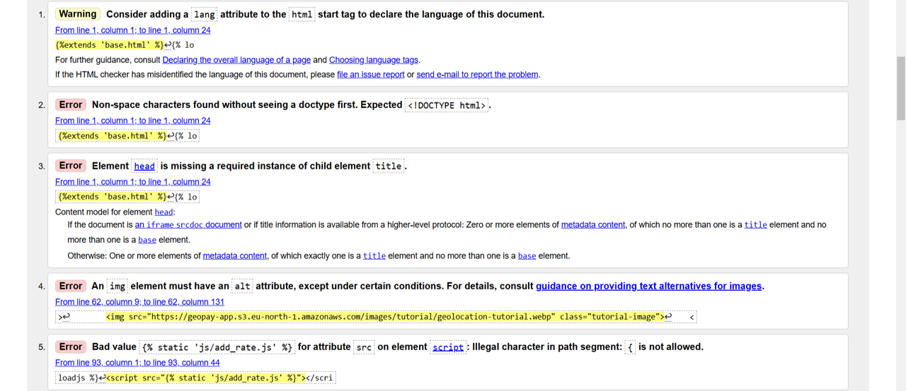</kbd>
    </p>
</details>

<details>
    <summary style="color: white; background: black; padding: 5px;">edit_parking.html (part 1)</summary>
    <p>
        <kbd>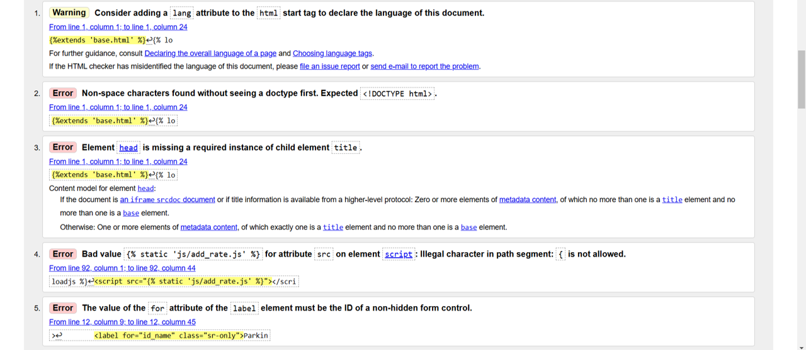</kbd>
    </p>
</details>

<details>
    <summary style="color: white; background: black; padding: 5px;">edit_parking.html (part 2)</summary>
    <p>
        <kbd>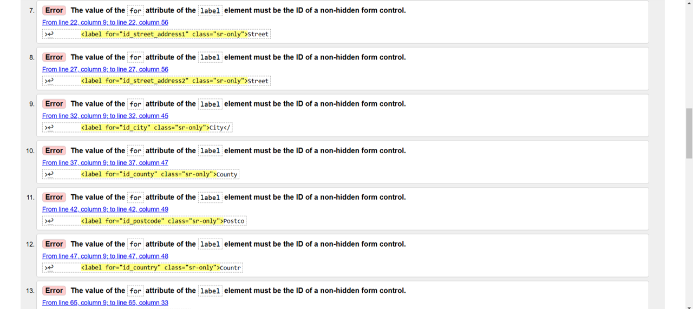</kbd>
    </p>
</details>

<details>
    <summary style="color: white; background: black; padding: 5px;">edit_parking.html (part 3)</summary>
    <p>
        <kbd>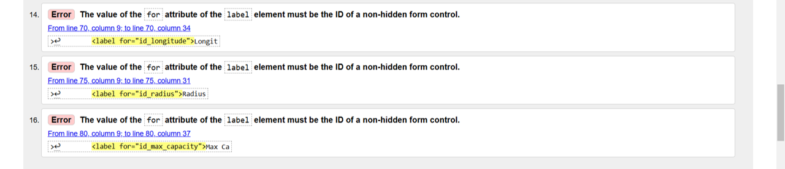</kbd>
    </p>
</details>

<details>
    <summary style="color: white; background: black; padding: 5px;">parking_info_block.html</summary>
    <p>
        <kbd>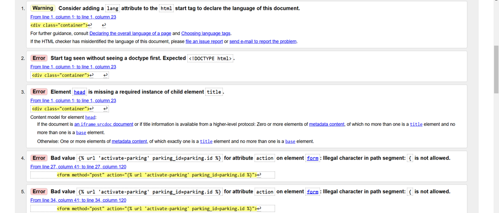</kbd>
    </p>
</details>

<details>
    <summary style="color: white; background: black; padding: 5px;">parking_location_block.html</summary>
    <p>
        <kbd>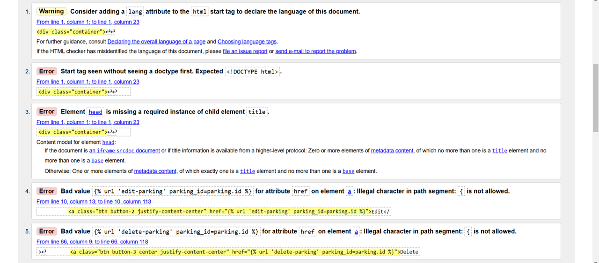</kbd>
    </p>
</details>

<details>
    <summary style="color: white; background: black; padding: 5px;">parking_rates_block.html</summary>
    <p>
        <kbd>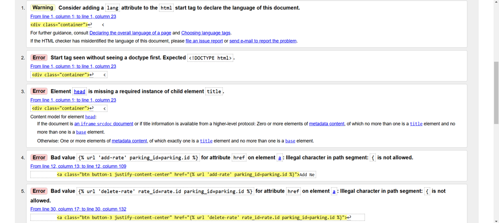</kbd>
    </p>
</details>

<details>
    <summary style="color: white; background: black; padding: 5px;">parking_info.html</summary>
    <p>
        <kbd></kbd>
    </p>
</details>

<details>
    <summary style="color: white; background: black; padding: 5px;">cars_checked_in.html</summary>
    <p>
        <kbd>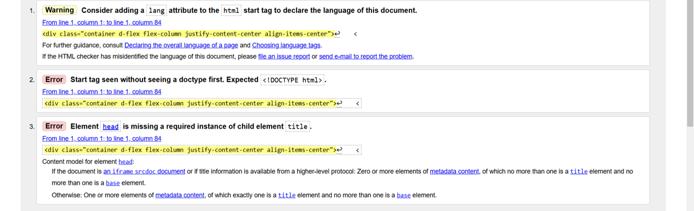</kbd>
    </p>
</details>

<details>
    <summary style="color: white; background: black; padding: 5px;">illegally_parked_cars.html</summary>
    <p>
        <kbd>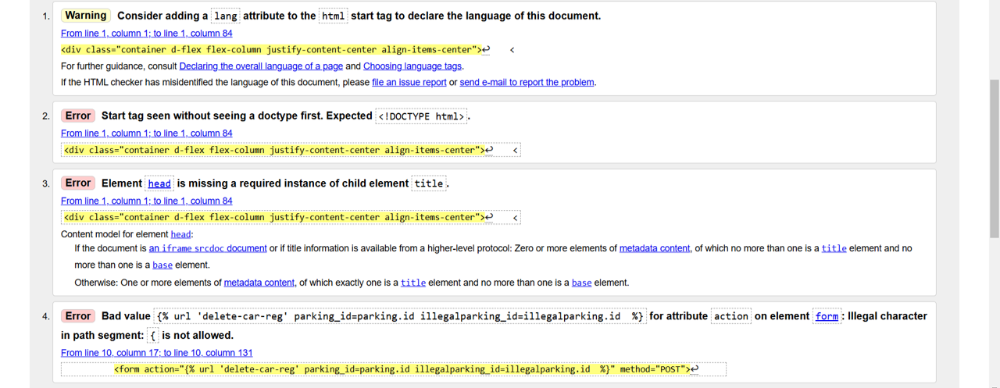</kbd>
    </p>
</details>

<details>
    <summary style="color: white; background: black; padding: 5px;">register_illegal_car.html</summary>
    <p>
        <kbd></kbd>
    </p>
</details>

<details>
    <summary style="color: white; background: black; padding: 5px;">parking_inspector.html</summary>
    <p>
        <kbd>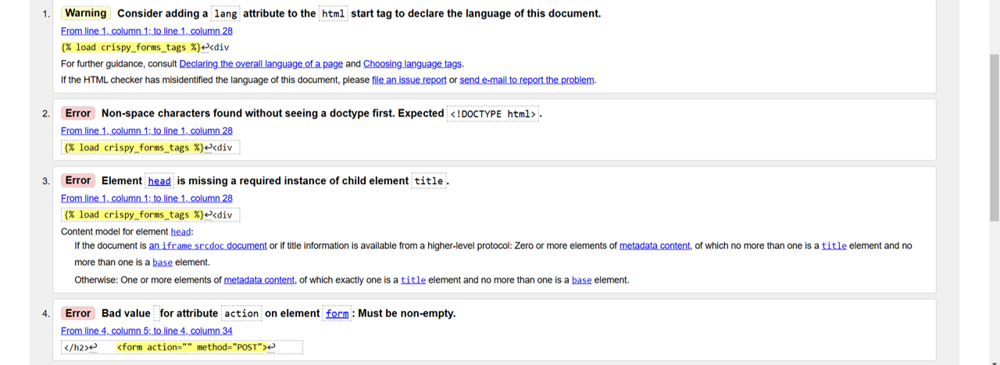</kbd>
    </p>
</details>

<details>
    <summary style="color: white; background: black; padding: 5px;">add_rate.html</summary>
    <p>
        <kbd>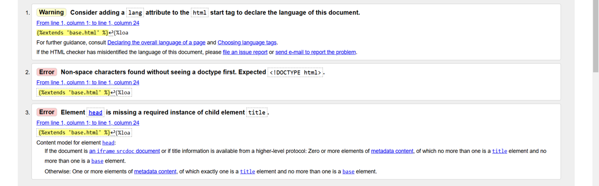</kbd>
    </p>
</details>

<details>
    <summary style="color: white; background: black; padding: 5px;">edit_rate.html</summary>
    <p>
        <kbd>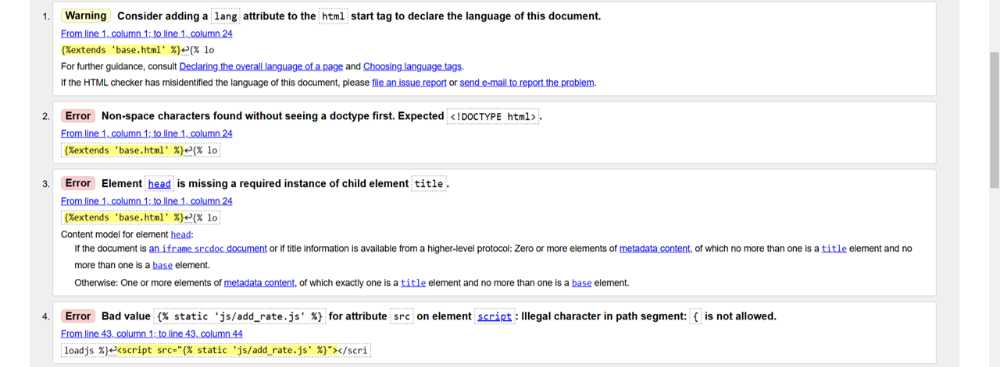</kbd>
    </p>
</details>

<details>
    <summary style="color: white; background: black; padding: 5px;">edit_user_account.html</summary>
    <p>
        <kbd>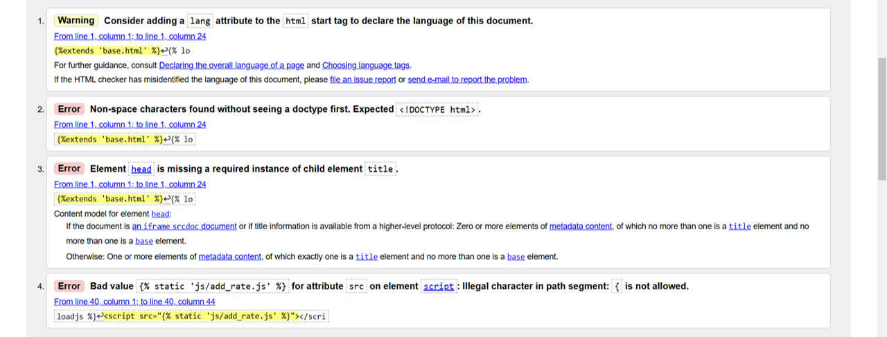</kbd>
    </p>
</details>

<details>
    <summary style="color: white; background: black; padding: 5px;">user_account.html</summary>
    <p>
        <kbd>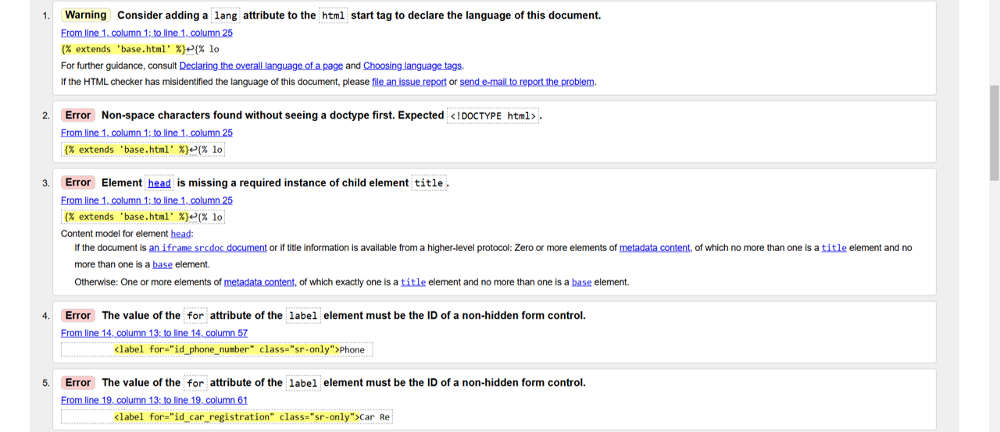</kbd>
    </p>
</details>

<details>
    <summary style="color: white; background: black; padding: 5px;">400.html</summary>
    <p>
        <kbd>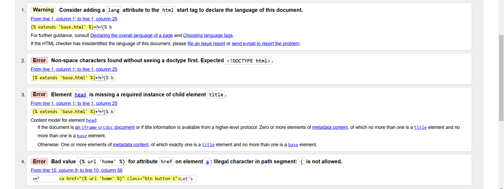</kbd>
    </p>
</details>

<details>
    <summary style="color: white; background: black; padding: 5px;">403.html</summary>
    <p>
        <kbd></kbd>
    </p>
</details>

<details>
    <summary style="color: white; background: black; padding: 5px;">404.html</summary>
    <p>
        <kbd></kbd>
    </p>
</details>

<details>
    <summary style="color: white; background: black; padding: 5px;">500.html</summary>
    <p>
        <kbd>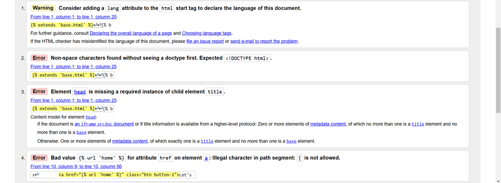</kbd>
    </p>
</details>

<details>
    <summary style="color: white; background: black; padding: 5px;">check_in_block.html</summary>
    <p>
        <kbd>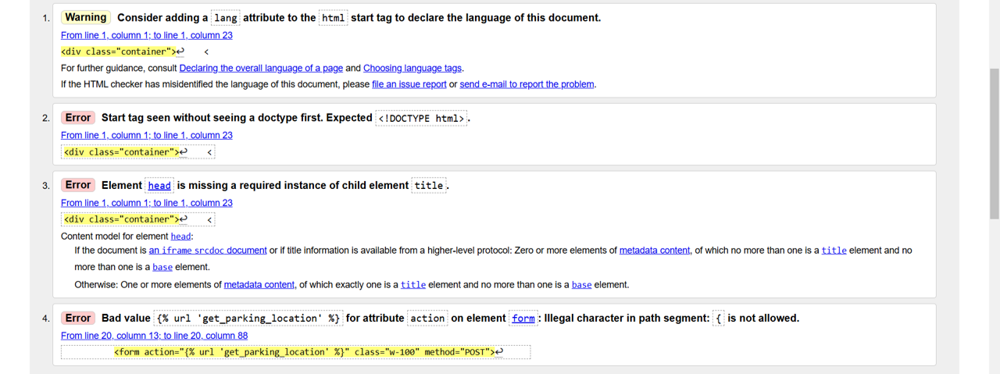</kbd>
    </p>
</details>

<details>
    <summary style="color: white; background: black; padding: 5px;">check_in_out_block.html</summary>
    <p>
        <kbd>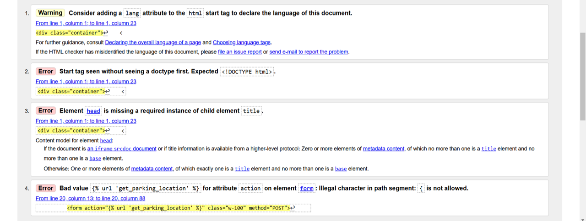</kbd>
    </p>
</details>

<details>
    <summary style="color: white; background: black; padding: 5px;">check_out_block.html</summary>
    <p>
        <kbd>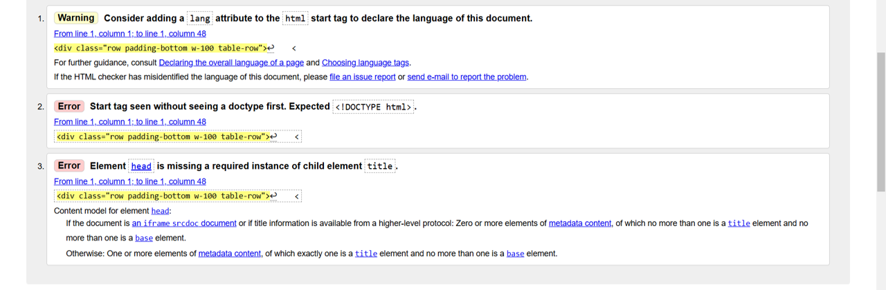</kbd>
    </p>
</details>

<details>
    <summary style="color: white; background: black; padding: 5px;">enter_registration_block.html</summary>
    <p>
        <kbd>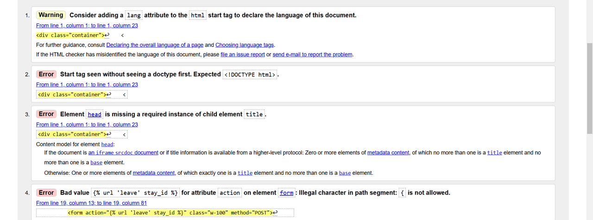</kbd>
    </p>
</details>

<details>
    <summary style="color: white; background: black; padding: 5px;">registration_prompt_block.html</summary>
    <p>
        <kbd>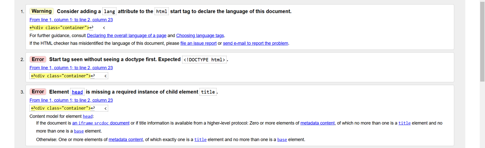</kbd>
    </p>
</details>

<details>
    <summary style="color: white; background: black; padding: 5px;">account_block.html</summary>
    <p>
        <kbd>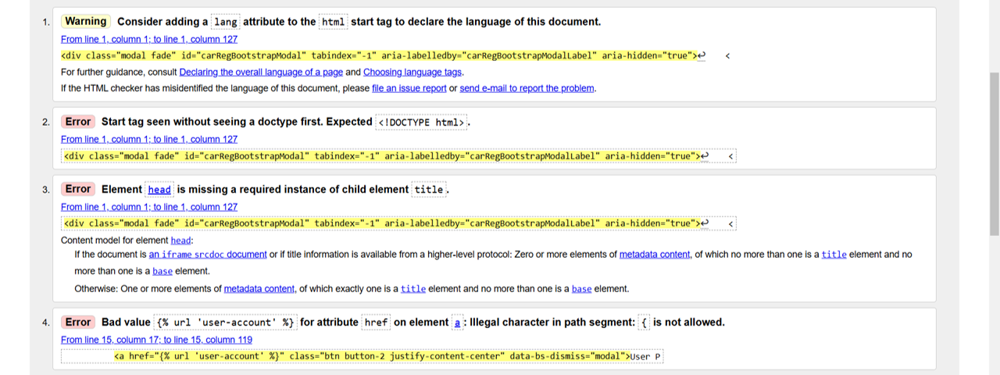</kbd>
    </p>
</details>

<details>
    <summary style="color: white; background: black; padding: 5px;">history_block.html</summary>
    <p>
       <kbd>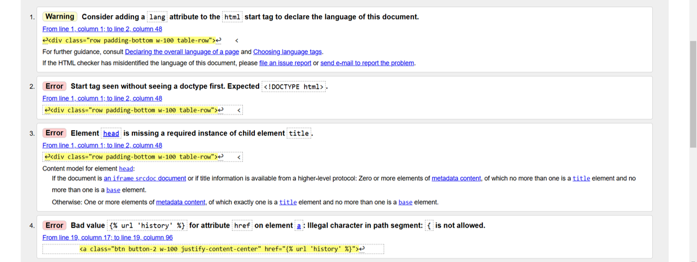</kbd>
    </p>
</details>

<details>
    <summary style="color: white; background: black; padding: 5px;">index.html</summary>
    <p>
        <kbd>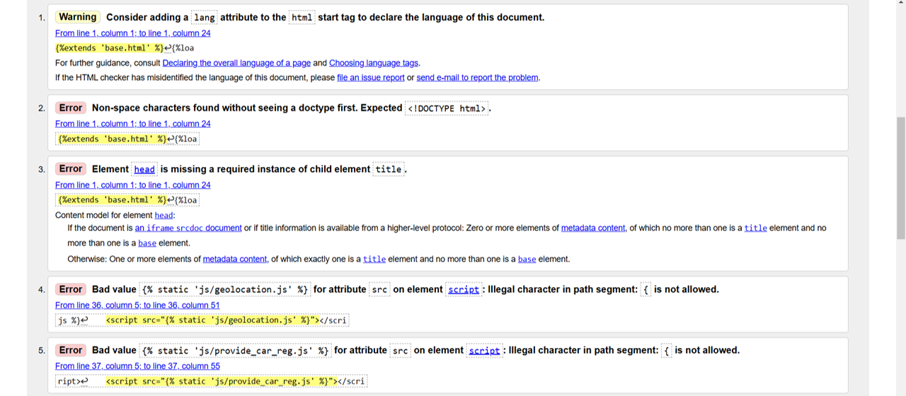</kbd>
    </p>
</details>

#### 5.1.2 CSS <a name="css"></a>

<details>
    <summary style="color: white; background: black; padding: 5px;">base.css</summary>
    <p>
        <kbd></kbd>
    </p>
</details>

#### 5.1.3 Javascript <a name="js"></a>

<details>
    <summary style="color: white; background: black; padding: 5px;">activate parking helper</summary>
    <p>
        <kbd></kbd>
    </p>
</details>

<details>
    <summary style="color: white; background: black; padding: 5px;">add rate</summary>
    <p>
        <kbd>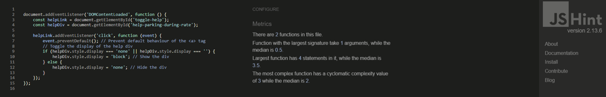</kbd>
    </p>
</details>

<details>
    <summary style="color: white; background: black; padding: 5px;">confirm delete user account</summary>
    <p>
        <kbd>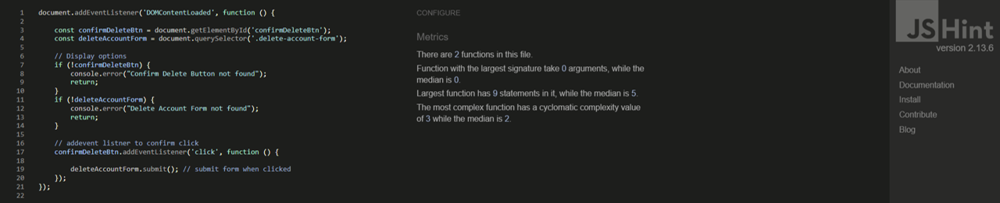</kbd>
    </p>
</details>

<details>
    <summary style="color: white; background: black; padding: 5px;">fade alert</summary>
    <p>
        <kbd>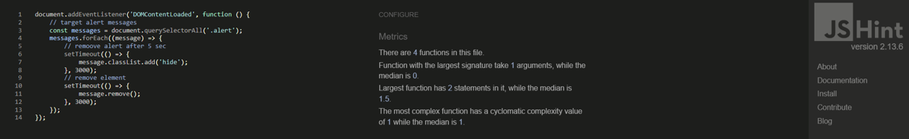</kbd>
    </p>
</details>

<details>
    <summary style="color: white; background: black; padding: 5px;">geolocation</summary>
    <p>
       <kbd></kbd>
    </p>
</details>

<details>
    <summary style="color: white; background: black; padding: 5px;">parking fee</summary>
    <p>
        <kbd>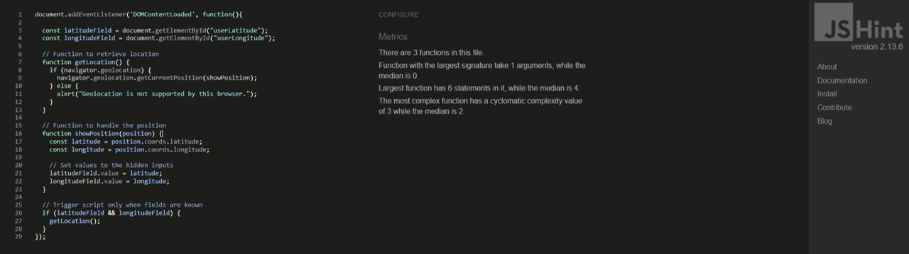</kbd>
    </p>
</details>

<details>
    <summary style="color: white; background: black; padding: 5px;">provide car reg</summary>
    <p>
        <kbd>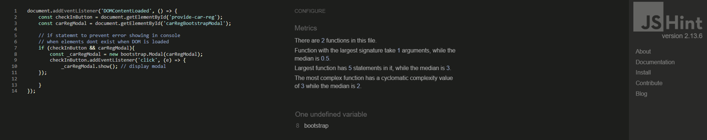</kbd>
    </p>
    <p>Note: var bootstrap is raised as an undefined variable. This is because JSHint does not have access to base.html where the variable is defined through the bootstrap library</p>
</details>

<details>
    <summary style="color: white; background: black; padding: 5px;">signup</summary>
    <p>
        <kbd>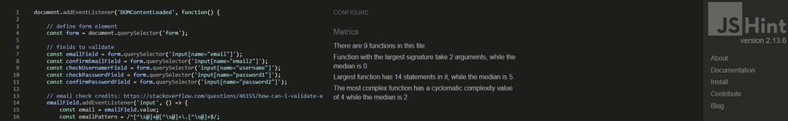</kbd>
    </p>
</details>

#### 5.1.3 Python <a name="py"></a>
### 5.2 Lighthouse Testing <a name="lighthouse-testing"></a>

<details>
    <summary style="color: white; background: black; padding: 5px;">LOGIN</summary>
    <p>
        <h3>Mobile</h3>
        <kbd></kbd>
    </p>
    <p>
        <h3>Desktop</h3>
        <kbd></kbd>
    </p>
</details>

<details>
    <summary style="color: white; background: black; padding: 5px;">Register</summary>
    <p>
        <h3>Mobile</h3>
        <kbd>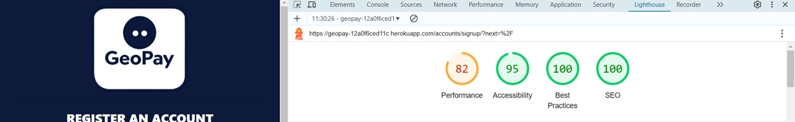</kbd>
    </p>
    <p>
        <h3>Desktop</h3>
        <kbd>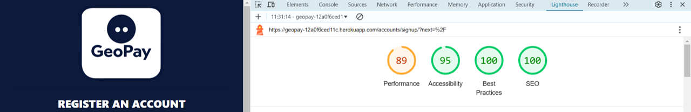</kbd>
    </p>
</details>

<details>
    <summary style="color: white; background: black; padding: 5px;">User Dashboard</summary>
    <p>
        <h3>Mobile</h3>
        <kbd>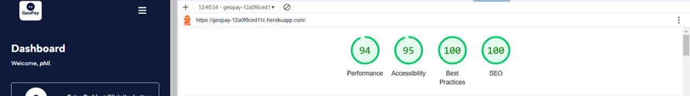</kbd>
    </p>
    <p>
        <h3>Desktop</h3>
        <kbd></kbd>
    </p>
</details>

<details>
    <summary style="color: white; background: black; padding: 5px;">Check In Dashboard</summary>
    <p>
        <h3>Mobile</h3>
        <kbd>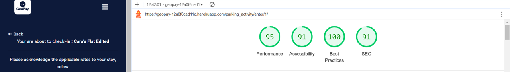</kbd>
    </p>
    <p>
        <h3>Desktop</h3>
        <kbd>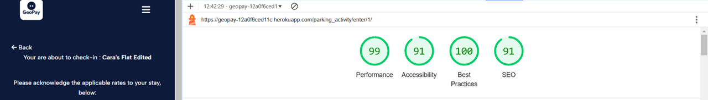</kbd>
    </p>
</details>

<details>
    <summary style="color: white; background: black; padding: 5px;">History</summary>
    <p>
        <h3>Mobile</h3>
        <kbd></kbd>
    </p>
    <p>
        <h3>Desktop</h3>
        <kbd>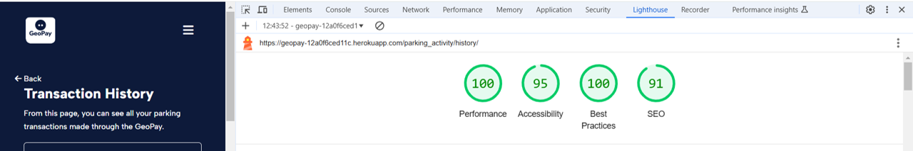</kbd>
    </p>
</details>

<details>
    <summary style="color: white; background: black; padding: 5px;">Account</summary>
    <p>
        <h3>Mobile</h3>
        <kbd>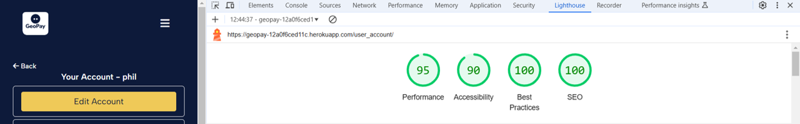</kbd>
    </p>
    <p>
        <h3>Desktop</h3>
        <kbd></kbd>
    </p>
</details>

<details>
    <summary style="color: white; background: black; padding: 5px;">Parking Manager Dashboard</summary>
    <p>
        <h3>Mobile</h3>
        <kbd>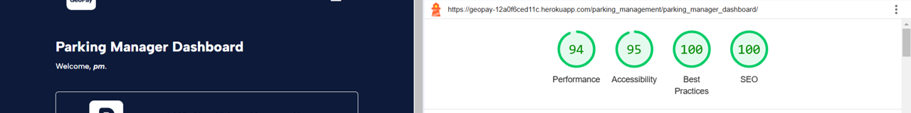</kbd>
    </p>
    <p>
        <h3>Desktop</h3>
        <kbd>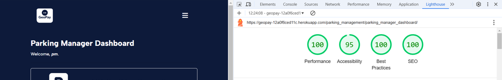</kbd>
    </p>
</details>

<details>
    <summary style="color: white; background: black; padding: 5px;">Create Parking</summary>
    <p>
        <h3>Mobile</h3>
        <kbd>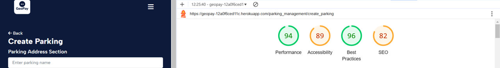</kbd>
    </p>
    <p>
        <h3>Desktop</h3>
        <kbd>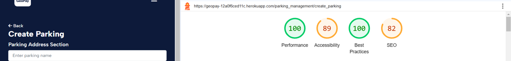</kbd>
    </p>
</details>

<details>
    <summary style="color: white; background: black; padding: 5px;">Parking Info</summary>
    <p>
        <h3>Mobile</h3>
        <kbd></kbd>
    </p>
    <p>
        <h3>Desktop</h3>
        <kbd>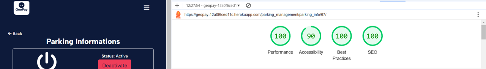</kbd>
    </p>
</details>

<details>
    <summary style="color: white; background: black; padding: 5px;">Parking Inspector</summary>
    <p>
        <h3>Mobile</h3>
        <kbd>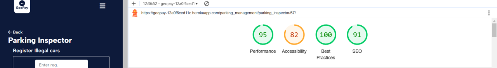</kbd>
    </p>
    <p>
        <h3>Desktop</h3>
        <kbd>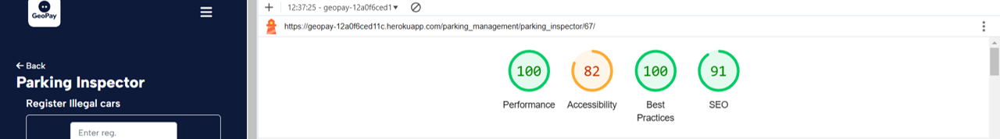</kbd>
    </p>
</details>

<details>
    <summary style="color: white; background: black; padding: 5px;">Add Rate</summary>
    <p>
        <h3>Mobile</h3>
        <kbd>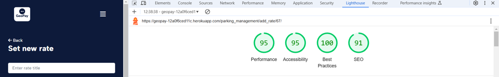</kbd>
    </p>
    <p>
        <h3>Desktop</h3>
        <kbd>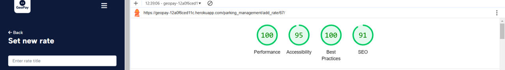</kbd>
    </p>
</details>


### 5.3 User Testing <a name="user-testing"></a>

<!-- Click on this link to see manual testing steps: [Manual Testing Guide](MANUAL_TESTING.md) -->

| Item | Description                                                                   | Steps                                                                                   | Expected Result                                                                           | Actual Result | Pass/Fail |
|------|-------------------------------------------------------------------------------|-----------------------------------------------------------------------------------------|------------------------------------------------------------------------------------------|---------------|-----------|
| 1    | Authentication - User can create an account with username, password, and email | User provides matching email address, matching passwords, and username                 | User is logged in.                                                                        |               |           |
| 2    | Authentication - Validators prevent user from creating an account with existing username | User registers with an existing username                                                | Error message notifying of username already taken.                                       |               |           |
| 3    | Authentication - Validators prevent user from creating an account with existing email address | User registers with an existing email address                                           | Error message notifying of email address already taken.                                  |               |           |
| 4    | Authentication - Validators prevent user from creating an account with non-matching email addresses | User registers with non-matching email addresses                                        | Error message notifying of non-matching email address.                                   |               |           |
| 5    | Authentication - Validators prevent user from creating an account with non-matching passwords | User registers with non-matching email passwords                                        | Error message notifying of non-matching passwords.                                       |               |           |
| 6    | Authentication - User receives registration confirmation email               | After registration process, user is prompted to check emails to find confirmation email | User is redirected to template telling them to open their emails to find the relevant email. |           |       |
| 7    | Authentication - User cannot login until verifying email address through provided link in email | Try to log in prior to confirming email address                                          | User is redirected to prompt to validate email address.                                  |               |           |
| 8    | Authentication - User can login after verifying their email address          | Try to log in after confirming email address                                             | User is redirected to index or parking manager dashboard.                                |               |           |
| 9    | Authentication - User can retrieve their password if they forgot it with email address | Click on "forgot password" on login and enter email address account was registered with | User is redirected to template asking to enter the email address they registered their account with. |        |      |
| 10   | Authentication - User receives transactional email with token to reset password | After requesting new password, open emails to find relevant email                       | User receives emails and clicks on the button to be redirected to password reset template. |           |       |
| 11   | Authentication - User can successfully reset password                        | After clicking on relevant email, enter 2 new matching passwords and receive confirmation (denial) | Password is reset, and the user can successfully log in with the new password.         |         |       |
| 12   | Authentication - User login with username and password                       | From the login page, enter username + password                                          | User is redirected to index or parking manager dashboard.                                |               |           |
| 13   | Authentication - If login or password credentials are incorrect user receives a message | From the login page, enter wrong username and/or wrong password                         | User receives a prompt that credentials entered are wrong.                               |               |           |
| 14   | Parking Manager - Parking User cannot access non-parking manager features    | Using the URL path to access parking_manager_dashboard + create_parking templates       | User is redirected to the parking manager dashboard.                                     |               |           |
| 15   | Parking Manager - User can create parking object                             | As Parking Manager, click on "add" parking button                                       | User is redirected to parking form.                                                     |               |           |
| 16   | Parking Manager - User cannot create parking object with partial information provided | As Parking Manager, populate all fields but one.                                        | User receives a prompt that the missing field is mandatory.                              |               |           |
| 17   | Parking Manager - User cannot enter a parking radius lower than 50m          | As Parking Manager, enter parking radius value = 10                                     | User receives a prompt saying minimum value is 50.                                       |               |           |
| 18   | Parking Manager - User edit parking object                                   | As Parking Manager, click on "edit" parking                                             | User is redirected to edit parking form.                                                |               |           |
| 19   | Parking Manager - User delete parking object                                 | As Parking Manager, click on "delete" parking                                           | Parking object is deleted and user receives a message confirming object is deleted.      |               |           |
| 20   | Parking Manager - User cannot delete parking object if parking user is checked-in | As Parking Manager, if a user has checked in try to delete parking                     | User receives a prompt advising this action isn’t possible while cars are checked-in.    |               |           |
| 21   | Parking Manager - User cannot activate parking without parking rate object created | As Parking Manager, click "activate" button without rate object                        | User is prompted to create a parking rate.                                               |               |           |
| 22   | Parking Manager - User can access parking information live status: active/inactive | As Parking Manager, click on "info" button to see activate/inactive                    | User can see if parking is active or inactive.                                           |               |           |
| 23   | Parking Manager - User can access parking information live status: space used | As Parking Manager, click on "info" button to see how many cars are currently checked-in | User can see how many cars are checked-in.                                              |               |           |
| 24   | Parking Manager - User can access parking information live status: parking inspector | As Parking Manager, from parking-info page click "parking inspector" button.           | User can access parking inspector by clicking the parking inspector button.              |               |           |
| 25   | Parking Manager - User can list car registrations parked in parking          | As Parking Manager, click on bottom left tab to see car registrations checked-in        | User can see a list of car registrations checked-in.                                     |               |           |
| 26   | Parking Manager - User can enter illegally parked registrations in parking inspector feature | As Parking Manager, enter car registration in input form from the parking inspector page | User can enter car registration in input fields.                                         |               |           |
| 27   | Parking Manager - User can access list of illegally parked cars from parking inspector feature | As Parking Manager, click bottom right tab to see car registrations entered from previous step. | User can see a list of illegally parked cars registered.                                 |               |           |
| 28   | Parking Manager - User can create parking rate                               | As Parking Manager, click on "Add New Rate" button                                      | User can create a new rate through rate form.                                            |               |           |
| 29   | Parking Manager - User cannot create 2 parking rates for same hour range     | As Parking Manager, in Add Rate page create a first rate and create a second one with the same hour_range field value (multiplier) | User is prompted that something is wrong and it might be because the same hour range is appointed to another rate object. |       |     |
| 30   | Parking Manager - User cannot create a parking at rate under value 0.1       | As Parking Manager, in Add Rate page create a rate value at 0.                          | User is prompted to add a value from 0.1.                                                |               |           |
| 31   | Parking Manager - User can edit a parking at rate.                           | As Parking Manager, click "Edit" and modify previously saved parking rate               | New parking rate is saved and displayed to the user.                                     |               |           |
| 32   | Parking Manager - User can delete a parking at rate.                         | As Parking Manager, click "delete" parking rate                                         | Parking rate object is deleted.                                                          |               |           |
| 33   | Parking Manager - User can activate and deactivate parking                   | As Parking Manager, "activate" and "deactivate" parking                                 | Parking objects are switched to activated or deactivated.                                |               |           |
| 34   | Parking Manager - User cannot delete parking rate if users are checked in    | As Parking Manager, click "delete" parking rate after a user checked in                 | User receives prompt that this action cannot be completed.                               |               |           |
| 35   | Parking User - User cannot access parking manager features                   | Using the URL path to access index + history templates                                  | User is redirected to index page.                                                        |               |           |
| 36   | Parking User - User cannot check in parking without car registration entered in profile | As Parking User, click "check-in" without populating car registration in profile        | User receives a prompt to populate profile first.                                        |               |           |
| 37   | Parking User - User can edit profile                                         | As Parking User, click "Profile", edit fields and save to see new values.               | User edits profile, saves and can see edited fields in profile template.                 |               |           |
| 38   | Parking User - User cannot access inactive parkings                          | As Parking User, connect to index and look for parking objects that Parking Manager left inactive | Users cannot see inactive parking displayed on index page.                               |               |           |
| 39   | Parking User - User can check in parking using geolocation                   | As Parking User, geolocation is activated on browser and user geolocation is matched with parking geolocation | User accesses enter template with parking name and applicable rates.                     |               |           |
| 40   | Parking User - User can check in manually if geolocation did not work        | As Parking User, click on "check-in" outside the range of parking object radius         | User accesses enter.html template and selects parking they want to check in and see applicable rates. |      |         |
| 41   | Parking User - User cannot check in if no parking value is selected          | As Parking User, click on "check-in" outside the range of parking object radius and click submit button without selecting parking | User is prompted to select a parking to complete the process.                            |               |           |
| 42   | Parking User - User can check out parking and pay                            | As Parking User, after checking-in, click "check-out" button, proceed to pay fee on Stripe and submit | User is redirected to Stripe for payment.                                                |               |           |
| 43   | Parking User - After checkout, user is redirected to success/cancel page     | As Parking User, after entering card details on Stripe, click submit button.            | User is redirected to cancelled/successful payment template.                             |               |           |
| 44   | Parking User - User receives transaction confirmation email after payment    | As Parking User, after being redirected to payment successful page, open email and find payment confirmation email | User receives email showing transaction ID + fee + parking name.                         |               |           |
| 45   | Stay Object - Object is updated in database to paid = True                   | As Parking User, check history transaction                                              | User can see transaction is marked as "paid" in History page.                            |               |           |
| 46   | Parking User - User can see transaction information from History section     | As Parking User, click "history" button from dashboard.                                 | User can see all past transactions.                                                      |               |           |
| 47   | Parking User - User can delete their profile                                 | As Parking User, click "profile" and click "delete" button.                             | User account is deleted from database and user is redirected to login page.              |               |           |
| 48   | Parking User - Before deleting their profile, user receives pop-up warning   | As Parking User, click "profile" and click "delete" button.                             | User receives a prompt asking to confirm intention to delete account.                    |               |           |
| 49   | Parking User - User cannot delete account if checked in                      | As Parking User, check-in and "delete" button on profile.                               | User receives a prompt saying they cannot delete their account until they have checked out. |               |           |
| 50   | Parking Manager - User cannot delete account if cars in their parking portfolio are checked in | As Parking Manager with checked-in car in one of my parkings, press "delete" button    | User receives a prompt saying they cannot delete their account until cars are checked out. |           |       |
| 51   | Back Button - User Account Page                                              | Click the Back button from the user-account page.                                       | Redirects the user to the home page.                                                     |               |           |
| 52   | Back Button - Payment Successful Page                                        | Click the Back button from the payment-successful page.                                 | Redirects the user to the home page.                                                     |               |           |
| 53   | Back Button - Payment Cancelled Page                                         | Click the Back button from the payment-cancelled page.                                  | Redirects the user to the home page.                                                     |               |           |
| 54   | Back Button - Parking Info Page                                              | Click the Back button from the parking-info page.                                       | Redirects the user to the home page.                                                     |               |           |
| 55   | Back Button - Add Rate Page                                                  | Click the Back button from the add-rate page.                                           | Redirects the user to the parking-info page of the corresponding parking_id.             |               |           |
| 56   | Back Button - Edit Rate Page                                                 | Click the Back button from the edit-rate page.                                          | Redirects the user to the parking-info page of the corresponding parking_id.             |               |           |
| 57   | Back Button - Create Parking Page                                            | Click the Back button from the create-parking page.                                     | Redirects the user to the home page.                                                     |               |           |
| 58   | Back Button - Undefined Page                                                 | Click the Back button from any page where the request.path is not / or /parking_management/parking_manager_dashboard/. | The browser navigates to the previous page using history.go(-1).                         |               |           |

## 6. Bugs <a name="bugs"></a>

### 6.1 Current bugs <a name="current-bugs"></a>

### 6.2 Design & User Experience improvements <a name="design-improvements"></a>

### 6.3 Logic improvements & Backend <a name="logic-improvements"></a>

## 7. Deployment <a name="deployment"></a>

### 7.1 Local Deployment <a name="local-deployment"></a>
**Project Deployment - Local**

**Project Creation**: The project starts by creating a folder from VS Code name M4Project.

Once the folder is created, click on folder to start from sratch.

**Local Deployment**: To copy this project, you can use git clone from your terminal.

Go to the terminal and input: git clone https://github.com/PhilMele/M4Project.git in the directory you wish to have the project folder in.

Using your code editor, such as VS Code: 
* click on open folder 
* click on the newly created folder.

**Database Deployment - PostGres**
To install PostGres on local, the following steps were followed.

To set up of PostGres on Local run : `pip install psycopg2` 

Issues encountered and solution:

This may have been specific to my local setup, but I had to use : pip install psycopg2-binary 

(Documentation: https://pypi.org/project/psycopg2-binary/). My requirements.txt file lists : psycopg2-binary==2.9.9

In settings.py, edit `DATABASES` variables to the following to point to the new local postgres database:
```python
    DATABASES = {
        'default': {
            'ENGINE': 'django.db.backends.postgresql',
            'NAME': 'm4project',
            'USER': '[yourusername]',
            'PASSWORD': '[yourpassword]',
            'HOST': 'localhost',
            'PORT': '5432', 
        }
    }
```

> [!IMPORTANT] 
> You will need to run your migration again (`python manage.py migrate`) and recreate a new superuser. All data will be lost.

Once this is done, you will want your data stored in a your .env file, to avoid secret keys being publicly available when pushing the project to github and adapting the variables to their environement (local, staging, production...). To do this, do the following:
* enter `pip install python-decouple`
* modify your settings.py to look like this:

```python
    from decouple import config

    DATABASES = {
        'default': {
            'ENGINE': 'django.db.backends.postgresql',
            'NAME': config('DB_NAME'),
            'USER': config('DB_USER'),
            'PASSWORD': config('DB_PASSWORD'),
            'HOST': config('DB_HOST', default='localhost'),
            'PORT': config('DB_PORT', default='5432'),
        }
    }
```

* Add values to variables to .env file. Note these dont need to be in string format, as they are considered strings by default. For this project, values need to attached to the following variables:

```python
    # stripe
    STRIPE_PUBLIC_KEY_TEST = 'value'
    STRIPE_SECRET_KEY_TEST ='value'
    STRIPE_WEBHOOK_SECRET_TEST = 'value'
    # local and heroku
    DATABASE_URL= 'value'
    DJANGO_SECRET_KEY = 'value'
    # for gmail
    EMAIL_HOST_USER = 'value'
    EMAIL_HOST_PASSWORD = 'value'
```

> [!NOTE]
> Credits - Instal postgres on local: https://www.postgresql.org/download/<br>
> Credits - Extra Documentation: https://pypi.org/project/psycopg2-binary/<br>

### 5.1 Heroku Deployment <a name="heroku-deployment"></a>

**Heroku Deployment**

In order to setup django for deployment on Heroku, the following steps were followed:

* Log into heroku : `heroku login`
* Add heroku remote : `git remote add heroku [Heroku Git URL]` (can be found in Heroku Settings)
* Push code to Heroku: `git push heroku master`
* Run first migration: `heroku run python manage.py migrate`

**Problem encountered**: the Procfile generated with command line from documentation echo web: gunicorn app:app > Procfile created an issue relating to encoding. The encoding defaulted to UTF-16 instead of UTF-8.

To solve this problem: create a new Procfile through a Notepad, selected encoding UTF-8 and called it Procfile.txt in the same location as the actual Procfile. I then deleted the previous Procfile and renamed Procfile.txt to Procfile.

> [!NOTE]
> Credits - Procfile encoding solution: https://stackoverflow.com/questions/19846342/unable-to-parse-procfile<br>


**Setup production environement**

In your settings.py add:

```python
    DEBUG = os.environ.get('DJANGO_DEBUG', '') != 'False'
```

In your Heroku Variable add `DJANGO_DEBUG` as `False`.

By default, if this is not specified, the server will consider as a development environement.

Add whitenoise in settings.py to middleware list
```python 
    STATICFILES_STORAGE = 'whitenoise.storage.CompressedManifestStaticFilesStorage'
```

> [!TIP]
> `MIME type ('text/html') is not a supported stylesheet MIME type, and strict MIME checking is enabled.`. Adding whitenoise corrected the error. See below for process to adding whitenoise.

> [!TIP]
> If the `.css` file is not loading in production, move `'whitenoise.middleware.WhiteNoiseMiddleware'` to the top.
> 
> ```python
> MIDDLEWARE = [
>     'django.middleware.security.SecurityMiddleware',
>     # Whitenoise package: used for production, should be set at the top
>     'whitenoise.middleware.WhiteNoiseMiddleware',
> ]
> ```

> [!IMPORTANT] 
> Everytime the static folder is changed, in particular for css, `python manage.py collectstatic` needs to be run from the console to push the changes to staticfiles.

> [!NOTE]
> Credits - https://stackoverflow.com/questions/19846342/unable-to-parse-procfile<br>
> Credits - https://developer.mozilla.org/en-US/docs/Learn/Server-side/Django/Deployment<br>


## 8. Credits <a name="credits"></a>

* `getLocation()` is a copy of `HTML Geolocation API` from W3Schools (https://www.w3schools.com/html/html5_geolocation.asp
)
* Stackoverflow: https://dev.to/chryzcode/django-json-response-safe-false-4f9i
* Overall Stripe Integration Youtube tutorial: The tutorial provided by the course material wasnt adapted to what I was looking for. Instead I followed the tutorial from this video (https://www.youtube.com/watch?v=hZYWtK2k1P8&t=1s) and made a number of changes to suit my project.
* RyanM on Stackoverflow for this answer: https://stackoverflow.com/questions/79256457/django-stripe-webhook-not-found/79256537#79256537 
* Crispy Form Documentation: https://django-crispy-forms.readthedocs.io/en/latest/
* Django Documentation: https://docs.djangoproject.com/en/5.1/topics/http/decorators/
* Gareth Mc Girr (mentor) who guided through this process
* Procfile encoding: https://stackoverflow.com/questions/19846342/unable-to-parse-procfile
* Django Deployment: https://developer.mozilla.org/en-US/docs/Learn/Server-side/Django/Deployment
* Regex Synthax: https://stackoverflow.com/questions/3518504/regular-expression-for-matching-latitude-longitude-coordinates
* Back button - https://stackoverflow.com/questions/524992/how-to-implement-a-back-link-on-django-templates
* Excluding pages from button display - https://stackoverflow.com/questions/41129551/django-creating-an-if-statement-based-on-the-request-path-not-working
* `request.resolver_match` : https://medium.com/@iamalisaleh/how-to-get-the-current-url-within-a-django-template-8270b977f280

**In additon**, there is a large number of stackoverflow, reddits and github posts that I should credit but didnt take note of them as I was trying out different solutions.

# colour palette


Django setup on local:
* Create `m4project`
* Open to `m4project` folder from terminal
* Create a virtual environment: in terminal enter the following command: `python -m venv env`.
* Activate the virtual environment: `venv/scripts/activate`
* Install Django : `pip install django`.
* Create a new Django project: `django-admin startproject m4project`
* Run the development server: `python manage.py runserver`

GIt ignore setup credits: https://djangowaves.com/tips-tricks/gitignore-for-a-django-project/

## Stripe (credit #payment logic: credits: https://www.youtube.com/watch?v=hZYWtK2k1P8&t=1s)

The tutorial provided by the course material wasnt adapted to what I was looking for. Instead I followed the tutorial from this video (https://www.youtube.com/watch?v=hZYWtK2k1P8&t=1s) and made a number of changes to suit my project.

Improvement: I would like payment to be made without the user having to enter their bank details everytime. I initially wanted to code these in the database, but stripe advises against this. As I wantedt o focus on the geofencing element, I accepted this and left the action for future improvements.

Steps:

* Install Stripe `pip install stripe`
* install Stripe CLI `winget install Stripe.StripeCLI` (for VS Code)
* Get Stripe secret key + public key : create profile on stripe and find them on dashboard + add to .env file
* Get `STRIPE_WEBHOOK_SECRET_TEST`: 
    * Login to stripe form command line: `stripe login`
    * Enter in command line: `stripe listen --forward-to localhost:8000/stripe_webhook`
    * Copy paste key in `STRIPE_WEBHOOK_SECRET_TEST: []` in .env file.

    @login_required 
    def payment(request,applicable_fee, stay_id):
        stripe.api_key = settings
        if request.method == 'POST':
            checkout_session = stripe.checkout.Session.create(
                payment_method_types = ['cards'],
                line_items =[
                    {
                        'price':applicable_fee,
                        'quantity':1,

                    },
                ],
                mode = 'payment',
                customer_creation = 'always',
                succesful_url = settings.REDIRECT_DOMAIN + '/payment_successful?session_id={CHECKOUT_SESSION_ID}',
                cancel_url = settings.REDIRECT_DOMAIN + '/payment_cancelled',
            )
            print(f'checkout_session = {checkout_session}')
            return redirect(checkout_session.url, code=303)

* Add secret keys to .env file

    STRIPE_PUBLIC_KEY_TEST = [the_key_here]
    STRIPE_SECRET_KEY_TEST= [the_key_here]
    STRIPE_WEBHOOK_SECRET = [the_key_here]

* Add to settings .py:
    from dotenv import load_dotenv
    load_dotenv()

    STRIPE_PUBLIC_KEY_TEST = os.getenv('STRIPE_SECRET_KEY')
    STRIPE_WEBHOOK_SECRET = os.getenv('STRIPE_WEBHOOK_SECRET')
    REDIRECT_DOMAIN = os.getenv('REDIRECT_DOMAIN', 'http://localhost:8000')

> [!TIP]
> Errors encountered:
> 
> `"Error in payment process: No API key provided."`
> 
> This was fixed by initialising the API key at the beginning of the logic:
> 
> ```python
> @login_required
> def payment(request, applicable_fee, stay_id):
>     try:
>         # Set API key at the beginning to avoid 
>         # "Error in payment process: No API key provided."
>         stripe.api_key = settings.STRIPE_SECRET_KEY_TEST
> ```

Add Stripe cutsomer ID in profile model:

    customer = stripe.Customer.create(
            email=request.user.email
            # Additional customer fields can be added here if needed
        )
        request.user.userprofile.stripe_customer_id = customer.id
        request.user.userprofile.save()

Pass id in logic: 
    customer=request.user.userprofile.stripe_customer_id,

Keep track of payment:
* When user is about to pay, stripe transaction is recorded

    @login_required
    def payment(request,applicable_fee,stay_id):
        ...

            #update stay model field with strip checkout id
            stay = Stay.objects.get(id=stay_id)
            stay.stripe_checkout_id = checkout_session.id
            stay.save()

* When user paid: stripe transaction is marked as true:

    @login_required
    def payment_successful(request):
        stripe.api_key = stripe.api_key = settings.STRIPE_SECRET_KEY_TEST
        checkout_session_id = request.GET.get('session_id', None)
        session = stripe.checkout.Session.retrieve(checkout_session_id)
        customer = stripe.Customer.retrieve(session.customer)
        
        #mark stay payment as successful (bool to Tue)
        stay = Stay.objects.get(stripe_checkout_id=checkout_session_id)
        stay.paid = True
        stay.save()
        print("Payment sucessful!")


## static files

* Install packages: `pip install django-storages boto3`
Add to settings.py:

    # Static files (CSS, JavaScript, Images)
    # https://docs.djangoproject.com/en/5.1/howto/static-files/

        STATIC_URL = 'static/'
        STATICFILES_DIRS = [
            os.path.join(BASE_DIR, 'static'),
        ]

        MEDIA_URL = '/media/'
        MEDIA_ROOT = os.path.join(BASE_DIR, 'media')

        STATIC_ROOT = os.path.join(BASE_DIR, 'staticfiles')

* Add to urls.py (project level):
    from django.conf import settings
    from django.conf.urls.static import static

    urlpatterns = [
    ...
    ]

    # Serve media files during development
    if settings.DEBUG:
        urlpatterns += static(settings.MEDIA_URL, document_root=settings.MEDIA_ROOT)

## Setup AWS S3 Bucket
The project does not have any media files, with the exception of the logo and favicon.

As a result, it felt that time should not be invested into a full integration of the S3 bucket.

The steps below cover the initial steps followed to setup an AWS account and host the logo file on S3.
* Create an account
* Create an S3 Bucket (untick `Block all public access`)
* Click on newly created bucket and go to Permissions
* write JSON bucket policy:
* Click `Policy Generator` and entert he following: 
    Type:`S3 Bucket Policy`
    Select `Allow`
    Principal: `*`
    Actions: `GetObject`
    ARN: `[enter ARN number from Properties tab]/*`
* Copy/Paste policy generated into the policy bucket.
* In terminal run:
    `pip install django-storages`
    `pip install boto3`
* In setting.py:

    INSTALLED_APPS = [
    
        #S3 bucket
        'storages',
    ]


## Heroku Setup (Production)
* Log into heorku : `heroku login`
* Add heroku remote : `git remote add heroku [Heroku Git URL]` (can be found in Heroku Settings)
* Push code to Heroku: `git push heroku master`
* Run first migration: `heroku run python manage.py migrate`

Problem encountered: the Procfile generated with command line from documentation echo web: gunicorn app:app > Procfile created an issue relating to encoding. The encoding defaulted to UTF-16 instead of UTF-8.

To solve this problem: create a new Procfile through a Notepad, selected encoding UTF-8 and called it Procfile.txt in the same location as the actual Procfile. I then deleted the previous Procfile and renamed Procfile.txt to Procfile.

### 

setup Debug = False
DEBUG = os.environ.get('DJANGO_DEBUG', '') != 'False'
crdiits: https://developer.mozilla.org/en-US/docs/Learn/Server-side/Django/Deployment

Add whitenoise in settings.py to middleware list

    STATICFILES_STORAGE = 'whitenoise.storage.CompressedManifestStaticFilesStorage'

> [!TIP]
> `MIME type ('text/html') is not a supported stylesheet MIME type, and strict MIME checking is enabled.`. Adding whitenoise corrected the error. See below for process to adding whitenoise.

> [!TIP]
> If the `.css` file is not loading in production, move `'whitenoise.middleware.WhiteNoiseMiddleware'` to the top.
> 
> ```python
> MIDDLEWARE = [
>     'django.middleware.security.SecurityMiddleware',
>     # Whitenoise package: used for production, should be set at the top
>     'whitenoise.middleware.WhiteNoiseMiddleware',
> ]
> ```

> [!NOTE]
> Procfile encoding: https://stackoverflow.com/questions/19846342/unable-to-parse-procfile

## geolocation

Credits: https://www.w3schools.com/html/html5_geolocation.asp


In geolocation.js add:
    const x = document.getElementById("userLocation");

    function getLocation() {
    if (navigator.geolocation) {
        navigator.geolocation.getCurrentPosition(showPosition);
    } else { 
        x.innerHTML = "Geolocation is not supported by this browser.";
    }
    }

    function showPosition(position) {
    x.innerHTML = "Latitude: " + position.coords.latitude + 
    "<br>Longitude: " + position.coords.longitude;
    }

add to base.html:

    
        <script src=""></script>
    

> [!TIP] `Uncaught TypeError: Cannot set properties of null (setting 'innerHTML')`. This was a result of the script being uploaded at the beginning of the template, before the element exists.  
> This problem was solved by moving this specific script to the bottom of the body of the template.  
> Add to `index.html`:
> 
> ```html
> <button onclick="getLocation()">Try It</button>
> <p id="userLocation"></p>
> ```

Once this has proven to work. We can proceed by incorporating the user location in the logic of `enter()`.

We add a few more variables to `getlocation()`, which will be used to feed some `hidden` input field in the Enter form in enter.html.

* add to geolocation.js:

    document.addEventListener('DOMContentLoaded', function(){
    
    const latitudeField = document.getElementById("userLatitude") # new
    const longitudeField = document.getElementById("userLongitude") # new

    function getLocation() {
        if (navigator.geolocation) {
        navigator.geolocation.getCurrentPosition(showPosition); 
        } else { 
        alert("Geolocation is not supported by this browser.");
        }
    }

    function showPosition(position) {

        const latitude = position.coords.latitude;
        const longitude = position.coords.longitude;

        // adds value to hidden inputs in index.html
        latitudeField.value = latitude; # new
        longitudeField.value = longitude; # new

    }
    getLocation() # new
    })

* add to enter.html the hidden inputs:

    <form method="post">
        
        <input type="hidden" id="userLatitude" name="latitude" value="">
        <input type="hidden" id="userLongitude" name="longitude" value="">
        {{stayform}}
        <input type="submit" onclick="getLocation()" value="OK">
    </form>

* in views.py  in `enter()`:

    @login_required
    def enter(request):
    
        if request.method == "POST":
            # capture user current location
            latitude = request.POST.get('latitude')
            longitude = request.POST.get('longitude')
            print(f'{request.user.username}: latitude = {latitude} + longitude = {longitude}')

Geolocation radius:
> [!NOTE]
> Geolocation credits: https://stackoverflow.com/questions/42686300/how-to-check-if-coordinate-inside-certain-area-python
> Geolocation credits: https://geopy.readthedocs.io/en/stable/#module-geopy.distance

* Install Geopy: `pip install geopy`
* import geopy in views.py (parking_activity app):

    from parking_management.models import Parking

* add distance calculation logic between user and parkings `enter()`:

    @login_required
    def enter(request):
    
        if request.method == "POST":
            ...

            # set user location in tuple
            user_location = [{'lat': {user_latitude}, 'lng': {user_longitude}}]
            user_location_tuple = (float(user_latitude), float(user_longitude))
          
            # match current user location to parking radius (if any)
            parkings = Parking.objects.all()
            
            # create for loop of parkings
            for parking in parkings:

                parking_radius = float(parking.radius)
                
                # set parking location in tuple
                parking_location_tuple = (float(parking.latitude), float(parking.longitude))

                #measure distance between user location and parking location
                locations_distance = distance.distance(
                    user_location_tuple,
                    parking_location_tuple).meters
                
                print("Distance: {}".format(locations_distance))

                if locations_distance <= parking_radius:
                    print(f'You are in {parking.name}')

                    ...

                else:
                    print(f'You are not in {parking.name}')


**Error encountered** `TypeError: float() argument must be a string or a real number, not 'set'`: following Igor-S answer on stackoverflow, I encountered this error.

This is because of the use of `({})`, which in Python define a set, rather than parentheses `()`.

To fix this error by converting the values into `float`:
    
    user_location = (float(user_latitude), float(user_longitude))

**Error encountered** `TypeError: '<=' not supported between instances of 'float' and 'str'`: following the above mentioned example provided on stackoverflow.

This error happened because `parking.radius` is a string and `locations_distance` is a float.

    if locations_distance <= parking_radius:
        print(f'You are in {parking.name}')
    else:
        print(f'You are not in {parking.name}')

Both values need to be in the same format:

    parking_radius = float(parking.radius)

**Error encountered** User geolocation innacuracy: in order to deal with lack of accuracy of the user location (which seems to be between 3m to 888m range based on various test), the minimum parking radius has been set to 1km (1000m).

In future development, this radius could be drastically reduced by using GPS location. This would require using native features of the phone. Either through a mobile app, or using Django's progressive web app.

* handle redirect to identified parking_id or not

Due to potential innacuracy in geolocation, `get_parking_location()` might not return a parking ID.

Depending on the scenario, `get_parking_location()` will redirect the user with out without the `parking id` as a parameter:

    return redirect('enter_with_parking_id', parking_id=parking_name.id)

    or

    return redirect('enter') 

To handle these two scenarios, two paths leading to the same view were made available:

    path('enter/', views.enter, name='enter'),
    path('enter/<int:parking_id>/', views.enter, name='enter_with_parking_id'),

The parameter is then returned in `enter()` and is given a default value of `None`:

    def enter(request, parking_id=None):

* StayForm() handling and submission

This part is handled by `enter()` and considers two scenarios through a form:
* if parking_id is provided as an argument, the user is asked to confirm they are happy to be marked as having entered `parking_id`
* if parking_id is None, the user is asked to select the parking name from a drop down menu.

Upon submission of the form, a Stay object is created, together with an Enter Object, both are linked via a foreign Key.

* rendering of parking fees (javascript)

Within the javascript document, the following logic is applied:

First implement a logic that collects the `parking_id`:

If provided as a parameter, the logic picks up the parking_id from the url

    // sets parking id as null by default
    let parkingId = "null";
    // captures parameter from url (if any)
    const path = window.location.pathname;
    const match = path.match(/\/enter\/(\d+)\//);
    const parkingIdFromParam = match ? match[1] : null;
    console.log(`parking id is ${parkingIdFromParam}`);

If not provided as parameter, a drop down menu needs to be added to the html template looping over the different parking names available.

    <!-- If parking ID is None -->
    <form method="post">
        
        <label for="parking-select">Select Parking:</label>
        <select id="parking-select" name="parking_name">
            <option value="">Select parking</option>
            
                <option value="{{ parking.id }}" 
                    
                        selected
                    >
                    {{ parking.name }}
                </option>
            
        </select>
        <input type="submit" value="Submit the form">
    </form>

Once a parking name is selected, variable `manuallySelectedParking` collects the chosen parking name, which in turn give `parkingId` the id of the parking selected.

    const manuallySelectedParking = document.getElementById('parking-select');
        console.log("manuallySelectedParking=", manuallySelectedParking);

    if(manuallySelectedParking){
        manuallySelectedParking.addEventListener('change', function(){
            console.log("this is getting accessed")
            parkingId = this.value || "null";
            console.log(`Updated parking id is ${parkingId}`);
            // only trigger fetchRates() if parking_id is not null
            // to avoid 404 error in console
            if (parkingId !== "null"){
                fetchRates();
            }
                
            })


Once `parking_id` is retrieved, the logic calls `get_parking_rates()` to return the parking rates. The function dynamically returns parking fees based on the parking selected.

    #used to get parking rates through API (dynamically generated with js)
    #note: safe = False allows to return a list instead of a dictonnary
    # this is because Json expect a dict by default (add error to log of errors encourntered)
    # credits: https://dev.to/chryzcode/django-json-response-safe-false-4f9i
    def get_parking_rates(request, parking_id):
        print(f'get_parking_rates parking id = {get_parking_rates}')
        rates = Rate.objects.filter(parking_name_id = parking_id).values(
            'rate_name',
            'hour_range',
            'rate',
        )
        return JsonResponse(list(rates), safe=False)

`get_parking_rates()` is called from parking_fee.js at the bottom of template : `enter.html`
    
**enter.html**

    
    <script src=""></script>
    

**parking_fee.js**

Create function `fetchRates()` to dynamically collect applicables rates from selected parking form the database.

    function fetchRates(){
        console.log(`ParkindId in fetchRates= ${parkingId}`);
        if(parkingId){
            fetch(`/parking_activity/get_parking_rates/${parkingId}/`)
            .then(response => response.json())
            .then(data =>{
                console.log("Fetched rates", data);
                renderRatesTable(data);
            })
            .catch(error => console.error("theres an error when getting the rates", error))
        }   
    }

Once the data is collected, it can then be rendered in `enter.html` template with `renderRatesTable()`.

    function renderRatesTable(data){

        // get the body of the table
        const table = document.getElementById("ratesTable");
        const tbody = document.querySelector("table tbody")
        tbody.innerHTML = "";

        if(data.length>0){
            
            // shows table
            table.style.display ="table"
            // Adds data to table rwos

            data.forEach(rate=>{
                const tableRow = document.createElement('tr');
                tableRow.innerHTML = `
                <tr>
                    <td>${rate.rate_name}</td>
                    <td>${rate.hour_range}</td>
                    <td>${rate.rate}</td>
                </tr>
                `;
                tbody.appendChild(tableRow);
            });
        }else{
            table.style.display = "none"
        }
    }

    <table>
        <thead>
            <tr>
                <th>Rate Name</th>
                <th>Hour Range</th>
                <th>Rate</th>
            </tr>
        </thead>
        <tbody></tbody>
    </table>


> [!TIP] `404 Page Not Found` when `parkingId` is null. To cover this, wrap `fetchRates()` within an if statement that checks if `parkingId` is null before triggering `fetchRates()`.
> 
> ```javascript
> if (parkingId !== "null") {
>     fetchRates()
> }
> ```

> [!NOTE]
> https://developer.mozilla.org/en-US/docs/Web/API/Geolocation_API
> https://stackoverflow.com/questions/42686300/how-to-check-if-coordinate-inside-certain-area-python
> https://geopy.readthedocs.io/en/stable/#module-geopy.distance

# Parking Management App

## Parking Manager Dashboard

## Create New Parking (form)

This feature is managed by `create_parking()`. 

To enable this `ParkingForm` is created in forms.py, allowing to create Parking model objects.

Upon successful submission, the newly created object passes its id, as a parameter to redirect the user to `parking_info()`

Use Crispy Forms:
* Run `pip install django-crispy-forms`
* Run `pip install crispy-bootstrap5`
* Run `pip install django-countries`

* In Installed_apps (Settings.py) add:

    INSTALLED_APPS = [
        'django.contrib.admin',
        ...
        #crispy form packages
        'crispy_forms',
        'crispy_bootstrap5',

    ]
* In Settings.py, add:

    CRISPY_TEMPLATE_PACK = 'bootstrap5'

## See Parking Details (CRUD)

# Parking Rates (CRUD)

# Parking Inspector (see registration, take note of those not registered)

## JS Validators on signup

## django logging to see logs in production

import os

    LOGGING = {
        "version": 1,
        "disable_existing_loggers": False,
        "handlers": {
            "console": {
                "class": "logging.StreamHandler",
            },
        },
        "root": {
            "handlers": ["console"],
            "level": "WARNING",
        },
        "loggers": {
            "django": {
                "handlers": ["console"],
                "level": os.getenv("DJANGO_LOG_LEVEL", "INFO"),
                "propagate": False,
            },
        },
    }

ciredits: https://docs.djangoproject.com/en/5.1/topics/logging/

## is_parking_customer()

## is_parking_manager()
Used to prevent non `parking_manager` user types to access parking_management app functions.

    class UserProfile(models.Model):
        user = models.OneToOneField(User, on_delete=models.CASCADE)
        user_type = models.IntegerField(choices=USER_TYPE, default = 1)
    

    def is_parking_manager(request):
        print(f'request.user.userprofile.user_type: {request.user.userprofile.user_type}')
        if request.user.userprofile.user_type != 2:
            return False
        return True

        @login_required
    def parking_manager_dashboard(request):
        if not is_parking_manager(request):
            return redirect('home')
        
        ...

If the user_type is not '2' (parking manager), return user to home page.

## decorators
from django.views.decorators.http import require_POST
@login_required

from django.contrib.auth.decorators import login_required
login_required


## error handlers


## Problem encountered - user getting logged out on mobile phone 
when opening new borwser window when scanning QR code

To solve this problem, add to settings.py:

    # Prevent sessions from being reset
    CSRF_COOKIE_SECURE = True
    SESSION_COOKIE_SECURE = True 
    SESSION_ENGINE = 'django.contrib.sessions.backends.cached_db'
    SESSION_COOKIE_DOMAIN = '.geopay-12a0f6ced11c.herokuapp.com'
    CSRF_TRUSTED_ORIGINS=['https://*.geopay-12a0f6ced11c.herokuapp.com']

credits: https://stackoverflow.com/questions/3976498/why-doesnt-session-expire-at-browser-close-true-log-the-user-out-when-the-bro

This has improve the result. However, the problem still persist. This could be due to the fact I havent deployed the SSL certificate on the site, as this is a paying feature.


Credits:
Validation for login : https://stackoverflow.com/questions/74245576/the-problem-of-not-displaying-validation-messages-in-allauth-after-overriding-al

## sites used
https://cdnjs.com/ : for cdn links
https://tabular.email/: for email template
https://icons8.com/ : icons on email
