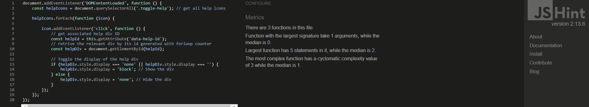
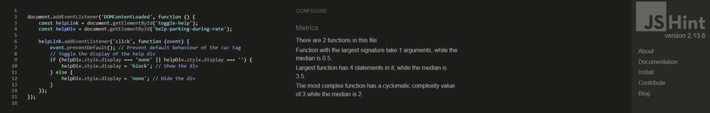
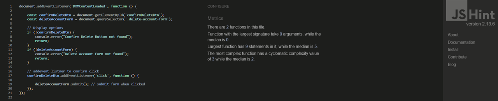
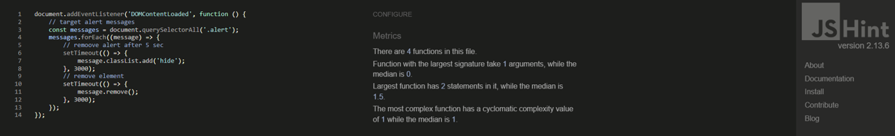
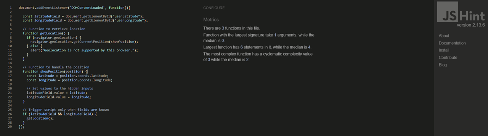
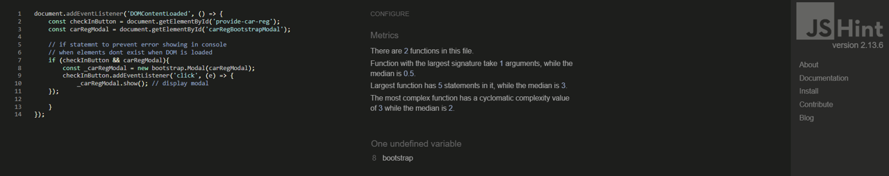
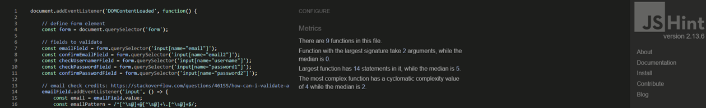

<h1>JSHint Testing Results</h1>

    
activate parking helper

    

        <kbd></kbd>
    

    
add rate

    

        <kbd></kbd>
    

    
confirm delete user account

    

        <kbd></kbd>
    

    
fade alert

    

        <kbd></kbd>
    

    
geolocation

    

       <kbd></kbd>
    

    
parking fee

    

        <kbd></kbd>
    

    
provide car reg

    

        <kbd></kbd>
    

    
Note: var bootstrap is raised as an undefined variable. This is because JSHint does not have access to base.html where the variable is defined through the bootstrap library

    
signup

    

        <kbd></kbd>
    

