<h1>Lighthouse Testing Results</h1>

    
LOGIN

    

        <h3>Mobile</h3>
        <kbd></kbd>
    

    

        <h3>Desktop</h3>
        <kbd></kbd>
    

    
Register

    

        <h3>Mobile</h3>
        <kbd></kbd>
    

    

        <h3>Desktop</h3>
        <kbd>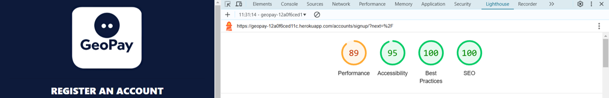</kbd>
    

    
User Dashboard

    

        <h3>Mobile</h3>
        <kbd>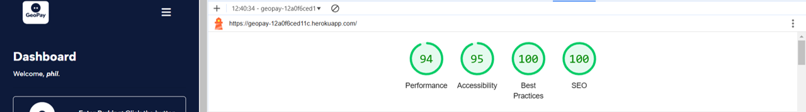</kbd>
    

    

        <h3>Desktop</h3>
        <kbd></kbd>
    

    
Check In Dashboard

    

        <h3>Mobile</h3>
        <kbd>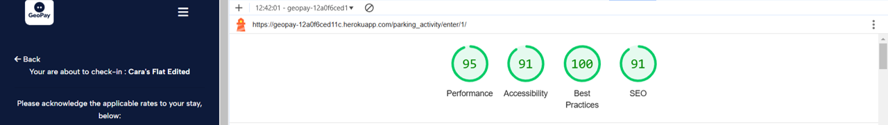</kbd>
    

    

        <h3>Desktop</h3>
        <kbd>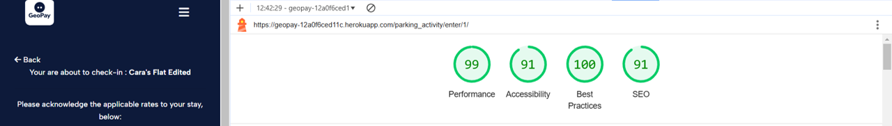</kbd>
    

    
History

    

        <h3>Mobile</h3>
        <kbd>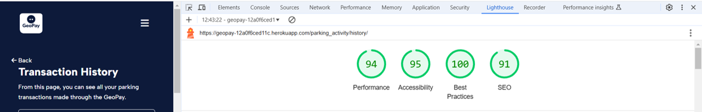</kbd>
    

    

        <h3>Desktop</h3>
        <kbd>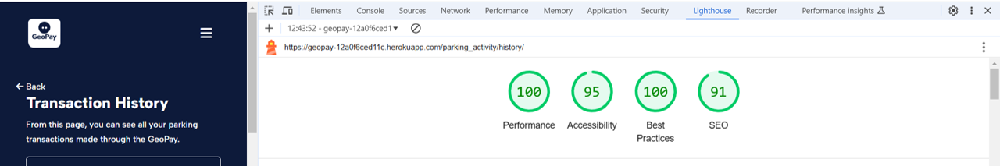</kbd>
    

    
Account

    

        <h3>Mobile</h3>
        <kbd>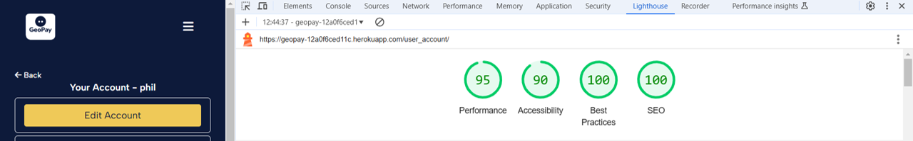</kbd>
    

    

        <h3>Desktop</h3>
        <kbd></kbd>
    

    
Parking Manager Dashboard

    

        <h3>Mobile</h3>
        <kbd>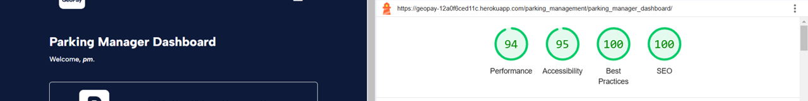</kbd>
    

    

        <h3>Desktop</h3>
        <kbd>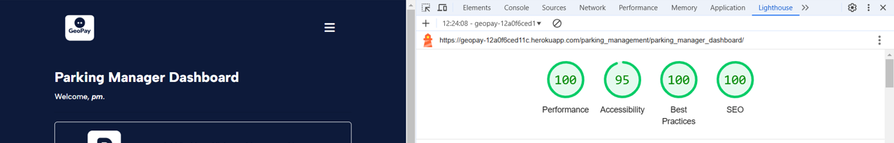</kbd>
    

    
Create Parking

    

        <h3>Mobile</h3>
        <kbd>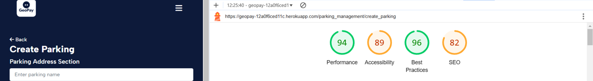</kbd>
    

    

        <h3>Desktop</h3>
        <kbd>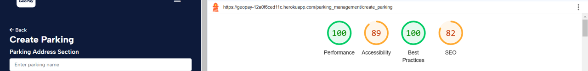</kbd>
    

    
Parking Info

    

        <h3>Mobile</h3>
        <kbd></kbd>
    

    

        <h3>Desktop</h3>
        <kbd>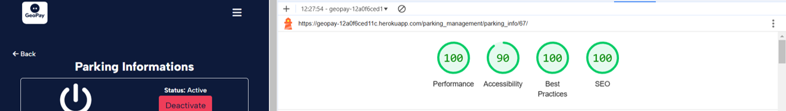</kbd>
    

    
Parking Inspector

    

        <h3>Mobile</h3>
        <kbd>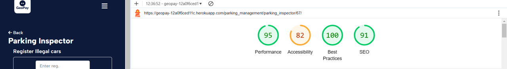</kbd>
    

    

        <h3>Desktop</h3>
        <kbd>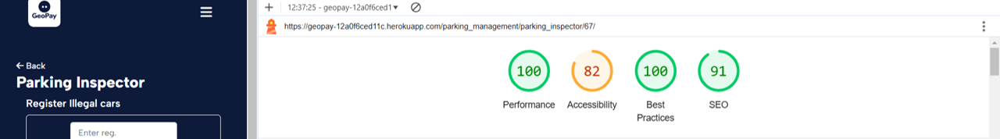</kbd>
    

    
Add Rate

    

        <h3>Mobile</h3>
        <kbd>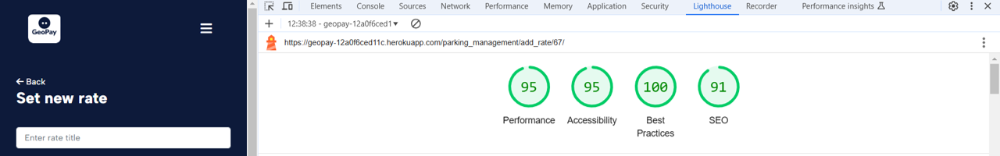</kbd>
    

    

        <h3>Desktop</h3>
        <kbd>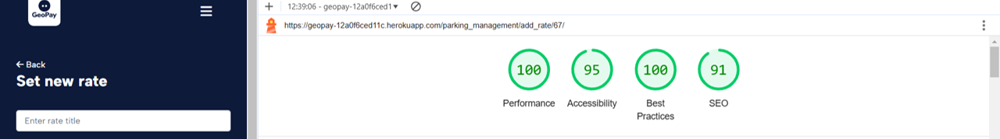</kbd>
    

