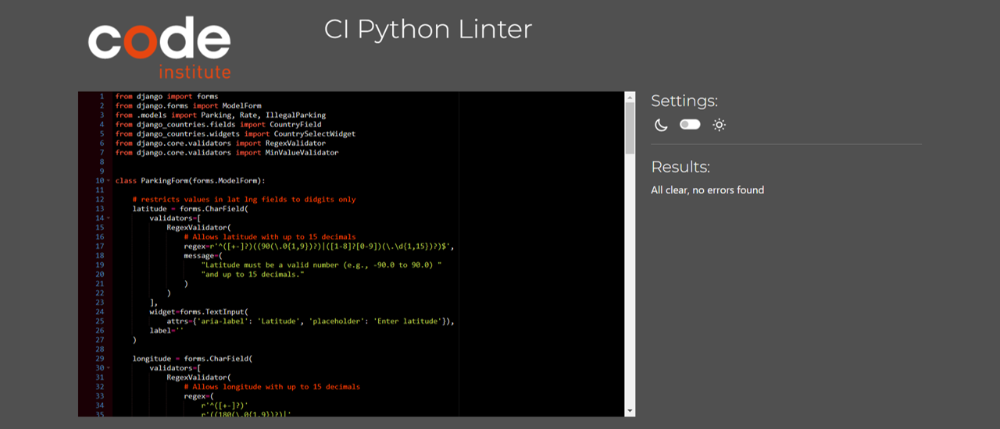

<h1>CI Python Linter Testing Results</h1>

**Project Level**

    
urls.py

    

        <kbd></kbd>
    

    
settings.py

    

        <kbd></kbd>
    

**User Management App**

    
views.py

    

        <kbd></kbd>
    

    
views.py

    

        <kbd></kbd>
    

    
urls.py

    

        <kbd></kbd>
    

    
models.py

    

        <kbd></kbd>
    

    
forms.py

    

        <kbd></kbd>
    

    
admin.py

    

        <kbd></kbd>
    

**Parking Management App**

    
views.py

    

        <kbd></kbd>
    

    
urls.py

    

        <kbd></kbd>
    

    
models.py

    

        <kbd></kbd>
    

    
forms.py

    

        <kbd></kbd>
    

    
admin.py

    

        <kbd></kbd>
    

**Parking Activity App**

    
views.py

    

        <kbd></kbd>
    

    
urls.py

    

        <kbd></kbd>
    

    
models.py

    

        <kbd></kbd>
    

    
forms.py

    

        <kbd></kbd>
    

    
admin.py

    

        <kbd></kbd>
    

